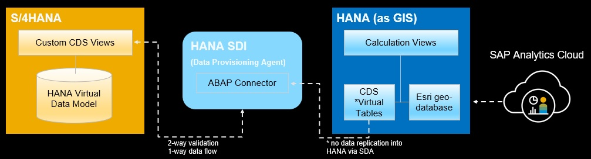

<table width=100% border=>
<tr><td colspan=2><h1>Exercise - Extending S/4HANA with ESRI Spatial Data</h1></td></tr>
<tr><td width=40%><h3>SAP Spatial</h3></td><td width=60%><h3>&nbsp;Difficulty Level: Intermediate</h3></td></tr>
</table>


## Description
In this exercise, you’ll learn how to integrate S/4HANA and ESRI GIS data at the data level. This integrated data will be consumed in SAP Analytics Cloud.

    

* In S/4HANA CDS views are created to combine customer sales, product, and location information
* The Data Provisioning Agent is installed and the ABAP adapter is registered with the SAP HANA system
* A Remote Connection is made from the HANA system to the S/4HANA system
* Virtual Tables of the S/4HANA CDS views are created
* In HANA the virtual tables from the S/4HANA data are combined with spatial tables in calculation views for consumption

For further reading on HANA Spatial and ESRI, click link below.

<http://www.sap.com>

## Target group

* Data analysts and developers
* People interested in learning about extending S/4HANA with ESRI data  


## Goal

XXXXXX


## Prerequisites
  
Here are the prerequisites for this exercise.

* S/4HANA system on premise system
* A technical S/4HANA user with appropriate roles (see list below)
* An SAP HANA on premise system
* An SAP HANA technical user with appropriate rights (see list below)
* An Eclipse IDE with HANA and ABAP tools installed

If you do not have your own S/4HANA system a trial system can be found at the [SAP Cloud Appliance Library.](https://cal.sap.com/console/tenant_5XPSH094G71U#/solutions/4dd49282-86ec-4e78-8b40-ef0c237012fa) If you are using the trial appliance then the appropriate user for this exercise is S4H_SD_DEM. Please see the Welcome page on the Windows Remote Desktop included with the appliance. 

Business Roles for the S/4HANA Technical User Should Include
* SAP_BR_SALES_MANAGER
* SAP_BR_PRODMASTER_SPECIALIST

Downloads and instructions for ABAP and HANA tools for Eclipse
	https://tools.hana.ondemand.com/

## Steps

1. [Creation of CDS Views in S/4HANA](#cdsview1)


### <a name="cdsview1"></a> Creation of CDS Views in S/4HANA
	
```
@AbapCatalog.sqlViewName: 'ZXSHCSLSORDITFSZ'
@AbapCatalog.compiler.compareFilter: true
@AccessControl.authorizationCheck: #NOT_REQUIRED
@ClientHandling.algorithm: #SESSION_VARIABLE
@EndUserText.label: 'Z Copy Sales Order Item'
@VDM.viewType: #CONSUMPTION

define view ZXSH_C_SALESORDERITEMFSZ as select from C_Salesorderitemfs
left outer join I_Customer
    on C_Salesorderitemfs.ShipToParty = I_Customer.Customer
left outer join I_Address
    on I_Customer.AddressID = I_Address.AddressID
{
    Customer,
    CustomerName,
    SalesOrder,
    RequestedDeliveryDate,
    SalesOrderItem,
    SalesOrderItemText,
    NetAmount,
    TransactionCurrency,
    RequestedQuantity,
    I_Address.AddressID,
    I_Address.AddressTimeZone,
    I_Address.CityName,
    I_Address.District,
    I_Address.Region,
    I_Address.County,
    I_Address.PostalCode
}
```

```
@AbapCatalog.sqlViewName: 'ZXSHCCUSTOMERGEO'
@ClientHandling.algorithm: #SESSION_VARIABLE
@AbapCatalog.compiler.compareFilter: true
@AccessControl.authorizationCheck: #NOT_REQUIRED
@EndUserText.label: 'customer geo data for location hierarchy'
@VDM.viewType: #CONSUMPTION

define view ZXSH_C_CUSTOMERGEO as select from I_Customer 
inner join I_Address
    on I_Customer.AddressID = I_Address.AddressID
{
   I_Customer.Customer as LHCustomer,
   I_Address.AddressID as LHAddressID, 
   I_Address.AddressTimeZone as LHAddressTimeZone, 
   I_Address.CityName as LHCityName,
   I_Address.District as LHDistrict,
   I_Address.Region as LHRegion,
   I_Address.County as LHCounty,
   I_Address.Country as LHCountry,
   I_Address.PostalCode as LHPostalCode
}
```

	
	

