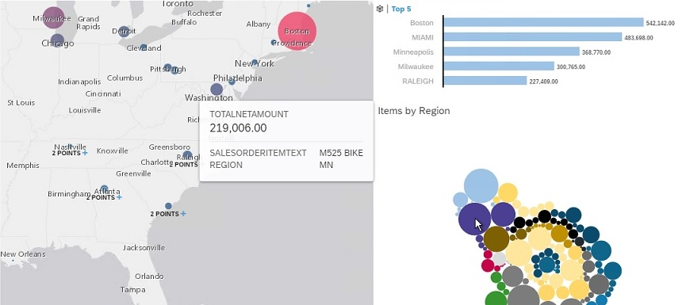
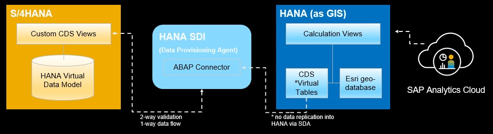

<table width=100% border=>
<tr><td colspan=2><h1>How to Extend S/4HANA with HANA Spatial and SAC</h1></td></tr>
<tr><td><h3>Exercise Overview</h3></td><td width=60%> &nbsp;Difficulty Level: Intermediate
</td></tr>
</table>

## Description
In this exercise / demo, you’ll learn how to integrate S/4HANA (on-premise) and ESRI GIS data at the data level. This integrated data will be consumed in SAP Analytics Cloud.

## Overview

* In S/4HANA CDS views are created to combine customer sales, product, and location information
* The Data Provisioning Agent is installed and the ABAP adapter is registered with the SAP HANA system
* A Remote Connection is made from the HANA system to the S/4HANA system
* Virtual Tables of the S/4HANA CDS views are created
* In HANA the virtual tables from the S/4HANA data are combined with spatial tables in calculation views for consumption

  

## Target group

* People interested in learning about extending S/4HANA (on-premise) with ESRI spatial data 
* People interested in extending S/4HANA with a HANA sidecar
* Data analysts and developers

## Prerequisites
  
Here is a list of the equipment prerequisites for this exercise. A link to the prerequisites page is farther below.

* A fully activated S/4HANA on-premise trial system
* An SAP HANA system: for this exercise you can use the HANA database on (a) S/4HANA or (b) in SAP Cloud Platform
* An SAP Analytics Cloud (SAC) account

Here are the knowledge prerequisites for this exercise.

* Familiarity with ABAP CDS views in S/4HANA
* Familiarity with Calculation views in SAP HANA
* Familiarity with Story design in SAP Analytics Cloud

[Go to the Prerequisites](exercises/preReqs.md)

## More Help & FAQ

For more info on this exercise, using the S/4HANA trial and the SAP Cloud Appliance Library please see [this help page.](exercises/genHelp.md)

##  Tasks

After you've completed the prerequisites there are a number of main tasks to complete. Some of these tasks will consist of running code in the Eclipse IDE with SAP tools. The Eclipse IDE is installed on the Windows client of the S/4HANA trial appliance. You will also need to import several HANA pieces like a sample database and some Calculation Vews.

1. You need to create two ABAP CDS views in our S/4HANA system. The first CDS view that needs to be created will include sales amounts by customer > location > product. The second CDS view that needs to be created will be a customer location hierarchy. This hierarchical data will be used later on in SAC for the mapping component.

&nbsp;&nbsp;&nbsp;&nbsp;&nbsp;&nbsp;&nbsp;[Go to Task 1: Creation of CDS Views in S/4HANA](exercises/s4hViews.md)

2. You need to create a HANA database user that has the rights to create Remote Sources and tables, import objects, create Calculation Views, etc.

&nbsp;&nbsp;&nbsp;&nbsp;&nbsp;&nbsp;&nbsp;[Go to Task 2: Creation of Developer User for the SAP HANA System](exercises/hdbUser.md)

3. The next task includes installing the Data Provisioning Agent, activating HANA's Data Provisioning server, creating Virtual Tables for the ABAP CDS views we created earlier.

&nbsp;&nbsp;&nbsp;&nbsp;&nbsp;&nbsp;&nbsp;[Go to Task 3: Setup of Smart Data Access to the S/4HANA System](exercises/sdiConfig.md)

4. A sample database is used for this exercise and consists of US Census data as well as a table used to approximate the Longitude and Latitude of customer addresses in the S/4HANA sales data. This task will be undertaken by the technical HANA user we created earlier.

&nbsp;&nbsp;&nbsp;&nbsp;&nbsp;&nbsp;&nbsp;[Go to Task 4: Setup of Sample Spatial Data for the SAP HANA System](exercises/hdbData.md)

5. XXXXXX

&nbsp;&nbsp;&nbsp;&nbsp;&nbsp;&nbsp;&nbsp;[Go to Task 5: Creation of HANA Calculation Views on Integrated Data](exercises/hdbViews.md)

6. XXXXXX

&nbsp;&nbsp;&nbsp;&nbsp;&nbsp;&nbsp;&nbsp;[Go to Task 6: Creation of Connection and Models and Story in SAP Analytics Cloud](exercises/sacAnalytics.md)

