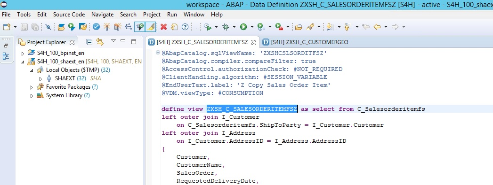
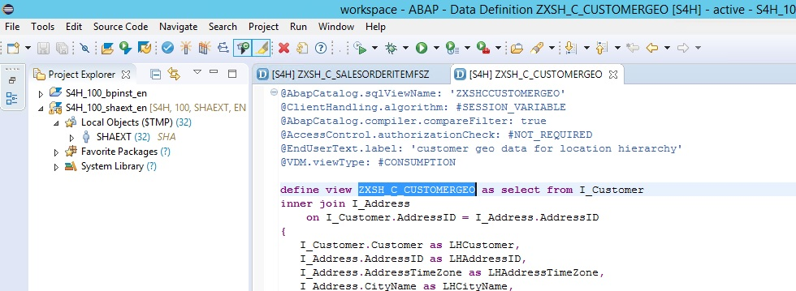

<table width=100% border=>
<tr><td colspan=2><h1>Exercise - Extending S/4HANA with ESRI Spatial Data</h1></td></tr>
<tr><td width=40%><h3>SAP HANA Spatial & S/4HANA</h3></td><td width=60%><h3>&nbsp;Difficulty Level: Intermediate</h3></td></tr>
</table>

## Description
In this exercise, you’ll learn how to integrate S/4HANA and ESRI GIS data at the data level. This integrated data can be consumed in SAP Analytics Cloud.


<iframe width="400" height="225" src="https://www.youtube.com/embed/nX54bL0GOcw" frameborder="0" allow="accelerometer; autoplay; encrypted-media; gyroscope; picture-in-picture" allowfullscreen></iframe>

<iframe width="560" height="315" src="https://www.youtube.com/embed/Onv9nhPIBp0" frameborder="0" allowfullscreen> </iframe>


## Overview

* In S/4HANA CDS views are created to combine customer sales, product, and location information
* The Data Provisioning Agent is installed and the ABAP adapter is registered with the SAP HANA system
* A Remote Connection is made from the HANA system to the S/4HANA system
* Virtual Tables of the S/4HANA CDS views are created
* In HANA the virtual tables from the S/4HANA data are combined with spatial tables in calculation views for consumption

  


For further reading on HANA Spatial and ESRI, click link below.

XXXXXX need appropriate link <http://www.sap.com>


## Target group

* Data analysts and developers
* People interested in learning about extending S/4HANA with ESRI spatial data  


## Prerequisites
  
Here are the equipment prerequisites for this exercise.

* A fully activated S/4HANA on premise trial system
* An SAP HANA system 
* An SAP Analytics Cloud (SAC) account
* A configured connection from the SAC tenant to the HANA system

Here are the knowledge prerequisites for this exercise.

* Familiarity with ABAP CDS views in S/4HANA
* Familiarity with Calculation views in SAP HANA
* Familiarity with Story design in SAP Analytics Cloud

It is highly recommenced that this exercise be done on a trial S/4HANA system as this is a technical / 'how to' demo. This demo also uses customer sales CDS views. On a trial systenm these views would only return several hundred records vs. what is on a production system. 

The S/4HANA trial system can be found at the [SAP Cloud Appliance Library.](https://cal.sap.com/console/tenant_5XPSH094G71U#/solutions/614183a7-11c6-4030-9908-81b6eab86d54) If you are using the trial appliance then the appropriate user for this exercise is S4H_SD_DEM. Please see the Welcome page on the Windows Remote Desktop included with the appliance. 

Business Roles for the S/4HANA technical user (S4H_SD_DEM) include:
* SAP_BR_SALES_MANAGER
* SAP_BR_PRODMASTER_SPECIALIST

Note that the appliance Windows machine includes a configured Eclipse IDE with the needed tools for ABAP CDS development installed. If you are interested in learning more about how to set up your own Eclipse environment, please see the downloads and instructions for ABAP and HANA tools for Eclipse at https://tools.hana.ondemand.com/

For more information on getting started with the S/4HANA fully activated trial appliance please see [these videos on the SAP HANA Academy.](https://www.youtube.com/playlist?list=PLkzo92owKnVwCbYmnsFkPQ8hCyzGmXO8_)

## <a name="steps"></a> Steps

1. [Creation of CDS View with Customer Sales, Products, and Location in S/4HANA](#cdsview1)
1. [Creation of CDS View with Customer Location Data in S/4HANA](#cdsview2)
1. [Setup of Remote Connection and Virtual Tables for the S/4HANA System](#remotecon)
1. [Setup of Sample Database for the SAP HANA System](#remotecon)
1. [Creation of SQL and Calculation Views on Integrated Data](#remotecon)
1. [Creation of Connection and Models and Story in SAP Analytics Cloud](#remotecon)

### <a name="cdsview1"></a> Creation of CDS View with Customer Sales, Products, and Location

The first CDS view that needs to be created will include sales amounts by customer > location > product. In your Eclipse ABAP project create a new CDS view with the following information.

```
Name = ZXSH_C_SALESORDERITEMFSZ
Description = Public Consumption View, Z Copy Sales Order Item
```



Copy the following code into the view editor. You can substitute the "SH" in ZXSH to match your namespace.
	
```
@AbapCatalog.sqlViewName: 'ZXSHCSLSORDITFSZ'
@AbapCatalog.compiler.compareFilter: true
@AccessControl.authorizationCheck: #NOT_REQUIRED
@ClientHandling.algorithm: #SESSION_VARIABLE
@EndUserText.label: 'Z Copy Sales Order Item'
@VDM.viewType: #CONSUMPTION

define view ZXSH_C_SALESORDERITEMFSZ as select from C_Salesorderitemfs
left outer join I_Customer
    on C_Salesorderitemfs.ShipToParty = I_Customer.Customer
left outer join I_Address
    on I_Customer.AddressID = I_Address.AddressID
{
    Customer,
    CustomerName,
    SalesOrder,
    RequestedDeliveryDate,
    SalesOrderItem,
    SalesOrderItemText,
    NetAmount,
    TransactionCurrency,
    RequestedQuantity,
    I_Address.AddressID,
    I_Address.AddressTimeZone,
    I_Address.CityName,
    I_Address.District,
    I_Address.Region,
    I_Address.County,
    I_Address.PostalCode
}
```

[Back to Steps](#steps)


### <a name="cdsview2"></a> Creation of CDS View with Customer Location

The second CDS view that needs to be created will be a customer location hierarchy. This hierarchical data will be used later on in the SAP Analytics Cloud for the mapping component. In your Eclipse ABAP project create a new CDS view with the following information.

```
Name = ZXSH_C_CUSTOMERGEO
Description = Public Consumption View, Customer Location Hierarchy
```



Copy the following code into the view editor. You can substitute the "SH" in ZXSH to match your namespace.

```
@AbapCatalog.sqlViewName: 'ZXSHCCUSTOMERGEO'
@ClientHandling.algorithm: #SESSION_VARIABLE
@AbapCatalog.compiler.compareFilter: true
@AccessControl.authorizationCheck: #NOT_REQUIRED
@EndUserText.label: 'customer geo data for location hierarchy'
@VDM.viewType: #CONSUMPTION

define view ZXSH_C_CUSTOMERGEO as select from I_Customer 
inner join I_Address
    on I_Customer.AddressID = I_Address.AddressID
{
   I_Customer.Customer as LHCustomer,
   I_Address.AddressID as LHAddressID, 
   I_Address.AddressTimeZone as LHAddressTimeZone, 
   I_Address.CityName as LHCityName,
   I_Address.District as LHDistrict,
   I_Address.Region as LHRegion,
   I_Address.County as LHCounty,
   I_Address.Country as LHCountry,
   I_Address.PostalCode as LHPostalCode
}
```

[Back to Steps](#steps)


### <a name="remotecon"></a> Setup of Remote Connection and Virtual Tables for the S/4HANA System

In order to connect your SAP HANA system to your S/4HANA system you need to first set up the Data Provisioning Agent.  
https://tools.hana.ondemand.com/ > click on the Cloud Integration tab > scroll down to the Data Integration Downloads section.

https://help.sap.com/viewer/p/HANA_SMART_DATA_INTEGRATION > in the Intallation and Upgrade section > click on the Installation and Configuration Guide

SDI ABAP Adapter https://www.youtube.com/watch?v=ZNr7xc3FHm0&list=PLkzo92owKnVwQ_preA3cxlQjn_v3W0Eh5&index=52&t=0s

[Back to Steps](#steps)


### <a name="remotecon"></a> Setup of Sample Database for the SAP HANA System

XXXXXX need steps and video links etc.	

[Back to Steps](#steps)


### <a name="remotecon"></a> Creation of SQL and Calculation Views on Integrated Data

XXXXXX need steps and video links etc.		

[Back to Steps](#steps)


### <a name="remotecon"></a> Creation of Connection and Models and Story in SAP Analytics Cloud

XXXXXX need steps and video links etc.		

[Back to Steps](#steps)

