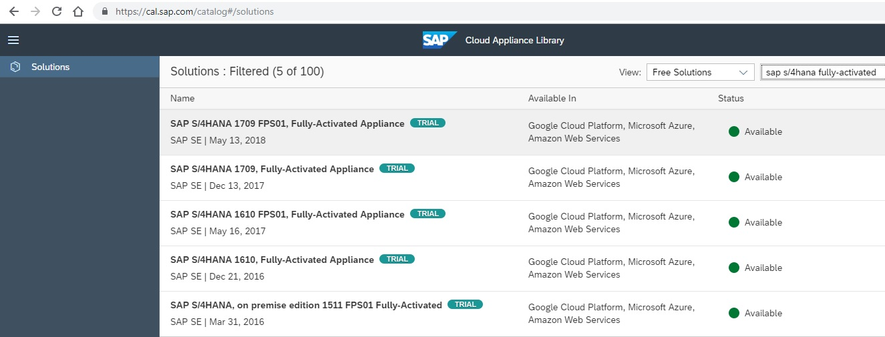

<table width=100% border=>
<tr><td colspan=2><h1>How to Extend S/4HANA with HANA Spatial and SAC&nbsp;&nbsp;&nbsp;&nbsp;&nbsp;&nbsp;&nbsp;&nbsp;&nbsp;</h1></td></tr>
<tr><td><h3>More Help and FAQ for this Exercise</h3></td><td width=60%> &nbsp;Development Environment
</td></tr>
</table>

## Description

In this page you can find out more info on using the trial images provided through the SAP Cloud Appliance Library. You can also find more info on working through this exercise and troubleshooting some issues you may encounter.

## Working with the 30-Day Trial of S/4HANA:

<h4>When should I start the 30-day trial for S/4 HANA?</h4>

Since the 30-day clock is based on the calendar and not the usage, you should not start your instance until you are ready to start the course. Please note that the Amazon AWS (or other provider) instance make take some time to create, so you might want to allow for that in your planning.

<h4>How long does it take to create the Amazon (or other provider) instance?</h4>

It can take up to 2 hours for AWS to create, validate and instantiate your instance for the first time. After that, it is only a few minutes to Activate your instance if you have suspended it.

<h4>How much does it cost to use AWS for this course?</h4>

As an example, the Amazon AWS infrastructure will cost about $3.40 per hour in the US. You may be charged a much smaller storage amount for the instance when it is not running. These usage and storage charges are from the provider e.g. Amazon and not from SAP.

If you kept this instance active for an entire month, it would be under $200. Please remember that the S/4 HANA license is only available for 30 days in the trial version, so if you are setting up the account just for this course, you will want to delete the AWS instance at the end of the course to stop any future billing.

<h4>What instance do I choose from the AWS console?</h4>

You actually only need to set up an account with the credit card for billing. Then, you will go to your Account settings and use the Security Credentials option to create the necessary keys to connect to AWS from within the SAP Cloud Appliance Library.  The S/4 HANA instance in CAL is pre-configured to select and create the appropriate back end servers.

<h4>Is the AWS billing for every hour or just those used?</h4>

If you suspend your instance through the SAP Cloud Appliance Library (CAL) console, you will reduce your billing costs to only those associated with storage (which is minimal). The main portion of the billing is for server “up time” and thus is deterred by managing the instance active times.

<h4>The Status of my instance shows “Undefined.”  What does that mean?</h4>

On occasion one of the servers included in the instance may not be properly initialized in AWS. This will show in a variety of errors, but is most easily spotted by having a status that does not turn to Active.  You can terminate this instance and request another instance to be created.  Note that it might take a few minutes for the terminated instance to disappear from the console and allow you to create another Trial instance in its place.

[Go Back to the Prerequisites Page](preReqs.md)

[Go Back to the Main Page](../demoHowTo.md)

## Working with the SAP Cloud Appliance Library (CAL) Console:

<h4>My CAL console logged off while I was waiting for the AWS instance to be created. What should I do?</h4>

You simply need to log on again. The server creation process is happening at Amazon.  The CAL console is just opening a window to the admin console for user interaction.

<h4>I want to get back into my instance after I suspended it. How do I connect?</h4>

1. First step is to Activate your instance from the Cloud Appliance Library (CAL) console.
1. Click on the instance to see the INFO details of that instance.
1. Copy the Windows External IP Address from the list of IP Addresses, and copy that into a Remote Desktop Connection.
1. Once the instance has fully activated in CAL, you will be able to use this Remote Desktop Connection to access the Windows server in your S/4 HANA landscape. All the work in this video set happens on this server.
1. If you disconnect and suspend in CAL, you will get a new IP address the next time you Activate the instance.

## Helpful Tips for Working Through the Exercise:

<h4>I am connecting to CAL with a Mac, is there anything different I need to do?</h4>

Please make sure you are using the Microsoft Remote Desktop utility available from the AppStore. 

<h4>When I open Eclipse on the image, it already has a connection to S4HANA using the BPINST user. Do I still need to create a new connection?</h4>

For the steps covered in our videos, we will be using a new connection for a new user we will create. Following along with the exercise tasks ensures that later steps will work as described.

<h4>I cannot log into Eclipse SAP Logon or Fiori Launchpad with the S4H_SD_DEM user or the BPINST user.</h4>

Please make sure you are using the proper case for the password: Welcome1

## General Notes for Troubleshooting:  

Please be careful with your case. Many of the scripts are case-sensitive.

Please note that these files may be changed with any new caveats, updates or resolutions that may arise.

[Go Back to the Prerequisites Page](preReqs.md)

[Go Back to the Main Page](../demoHowTo.md)
