<table width=100% border=>
<tr><td colspan=2><h1>How to Extend S/4HANA with HANA Spatial and SAC</h1></td></tr>
<tr><td><h3>Setup of HANA for Resource Sharing</h3></td><td width=60%></br>&nbsp;Task #6, WinSCP and Eclipse IDE
</table>

## Description

In the next steps you will configure the SAP HANA system so that resources like Calculation Views can be consumed on the SAP Analytics Cloud. 


## Prerequisites

You should have completed all of the exercise [Prerequisites](../exercises/preReqs.md). You should have also completed [Task 5: Creation of HANA Calculation Views on Integrated Data](hdbViews.md) using the Eclipse IDE.

## Warnings

During the installation process for the SAP HANA EPM-MDS plugin your HANA system will be stopped and started automatically.

## <a name="steps"></a> Steps

A connection must be made between your SAP HANA database and the SAP Analytics Cloud. In order to establish the sharing of objects from HANA with SAC, you must do so with either [CORS (Cross-Origin Resource Sharing) or via a reverse proxy.](https://blogs.sap.com/2017/12/29/creating-sap-analytics-cloud-live-connection-to-sap-hana-database-on-sap-cloud-platform/) In this exercise you will set up CORS and then later a "Direct" connection will be used in SAC.

An additional component will be installed on HANA and then Cross Origin Resource Sharing will be configured.

1. [Checking to see if the SAP HANA EPM-MDS Plugin is Already Installed](#epmmdstest)
1. [Downloading the SAP HANA EPM-MDS Plugin](#epmmds)
1. [Connecting WinSCP to the S/4HANA Appliance's Linux File System](#winscp)
1. [Installing the SAP HANA EPM-MDS Plugin](#epmmdsinst)
1. [Configuring Cross Origin Resource Sharing, CORS](#cors)

### <a name="epmmdstest"></a> Checking to see if the SAP HANA EPM-MDS Plugin is Already Installed

In this exercise, you will most likely need to download the EPM-MDS plugin which will facilitate a connection between the SAP Analytics Cloud and SAP HANA Calculation Views. At this time (January 3rd 2019 at 06:56 AM PST) and as per [this SAP KBA](https://apps.support.sap.com/sap/support/knowledge/public/en/2536153) this plugin is not installed by default on HANA 2.0.

To first check to verify thta the EPM-MDS plugin is not installed, open the url below in your Windows desktop client and log in as your HACKT28 user. You assigned this user the rights for this in an earlier lesson.

```
URL: https://vhcalhdbdb.dummy.nodomain:4302/sap/bc/ina/service/v2/GetServerInfo

Returned: {"Messages":[{"Number":42001,"Type":2,"Text":"InformationAccess Service GetServerInfo is not available. Install the SAP HANA EPM-MDS plugin."}]}
```

You have now completed the step "Checking to see if the SAP HANA EPM-MDS Plugin is Already Installed". If you do get the above message returned then please proceed to the next step.

If the above message is not returned and you do in fact get a whole bunch of server info back then please proceed to the later step [Configuring Cross Origin Resource Sharing aka CORS](#cors).

[Go Back Up to the List of Steps](#steps)

### <a name="winscp"></a> Connecting WinSCP to the S/4HANA Appliance's Linux File System

This step will involve using WinSCP which was downloaded and installed in the Prerequisite section. It will be used to transfer the EPM-MDS plugin from the Windows desktop client to the S/4HANA machine's file system.

* Open up WinSCP and enter the following information into the main dialogue.

```
Host Name: vhcalhdbdb.dummy.nodomain
User Name: root
```

&nbsp;&nbsp;&nbsp;&nbsp;&nbsp;&nbsp;&nbsp;&nbsp;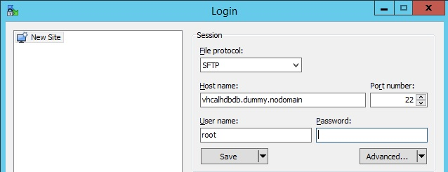

* Press the "Advanced" button.
* Click on "Authentication".

&nbsp;&nbsp;&nbsp;&nbsp;&nbsp;&nbsp;&nbsp;&nbsp;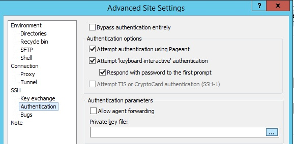

* Press the browse button for the "Private key file" and navigate to where you stored your pem file in the Prerequisites.
* In the file type select "All Private Key Files".

&nbsp;&nbsp;&nbsp;&nbsp;&nbsp;&nbsp;&nbsp;&nbsp;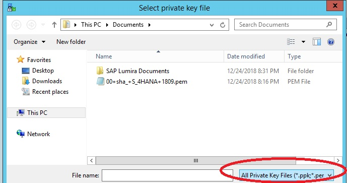

* Select your pem file and press Open.
* Press OK to convert the Open SSH Private Key to a Putty (ppk) format.

&nbsp;&nbsp;&nbsp;&nbsp;&nbsp;&nbsp;&nbsp;&nbsp;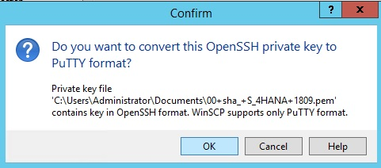

* For the Password enter the main password that you used when you created your appliance in CAL.SAP.com and press OK.

&nbsp;&nbsp;&nbsp;&nbsp;&nbsp;&nbsp;&nbsp;&nbsp;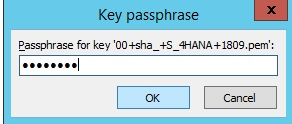 

* Press the Save button to save the ppk file to the same directory as your original pem file.

&nbsp;&nbsp;&nbsp;&nbsp;&nbsp;&nbsp;&nbsp;&nbsp;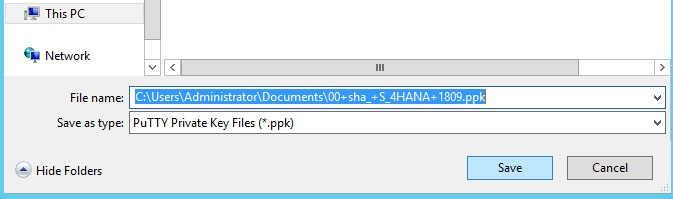

* You should get a successful message. Press the OK button to close this message and then press the OK button to close the Advanced Site settings dialogue.
* In the main WinSCP dialogue press the Save button and then the OK button to accept the default name.

&nbsp;&nbsp;&nbsp;&nbsp;&nbsp;&nbsp;&nbsp;&nbsp;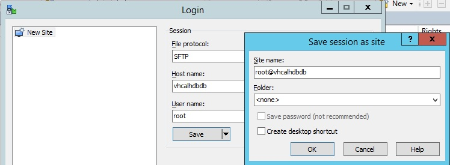

* Press the "Login" button and then press "Yes" to ignore any warning about connecting to an unknown server.
* Enter the password you used earlier and then press OK. You should now be connected to the file system of the Linux machine hosting your S/4HANA system.

&nbsp;&nbsp;&nbsp;&nbsp;&nbsp;&nbsp;&nbsp;&nbsp;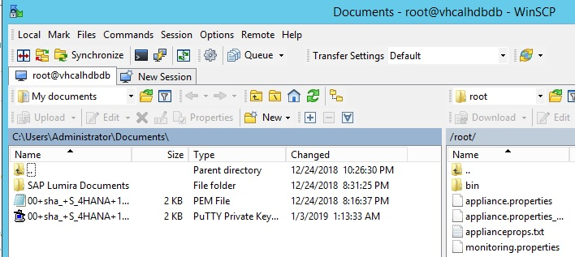

You have now completed the step "Connecting WinSCP to the S/4HANA Appliance's Linux File System".

[Go Back Up to the List of Steps](#steps)

### <a name="epmmds"></a> Downloading the SAP HANA EPM-MDS Plugin

The next step will be to download the EPM-MDS plugin which, as mentioned earlier, will facilitate a connection between the SAP Analytics Cloud and SAP HANA Calculation Views. 

* To download the plugin go to [Support.SAP.com](https://launchpad.support.sap.com/#/softwarecenter/search/SAP%2520HANA%2520EPM-MDS) and then you should see results for SAP HANA EPM-MDS.
&nbsp;&nbsp;&nbsp;&nbsp;&nbsp;&nbsp;&nbsp;&nbsp;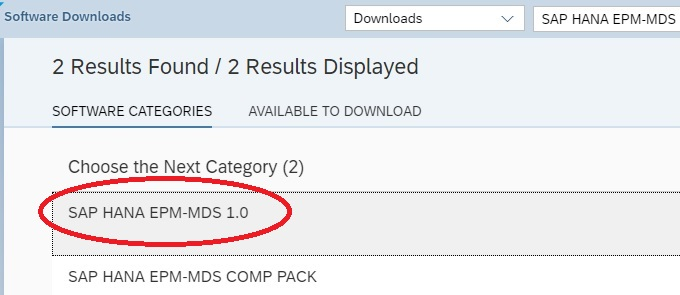

* Select SAP HANA EPM-MDS 1.0 and you should see a cornucopia of download options. In this case you do not want to download the latest release as they are geared to a specific release of HANA.
* To get your HANA version, one way is to open up a SQL Console as your HACKT28 user and run the following SQL code.

```
SELECT version FROM m_database;
```

&nbsp;&nbsp;&nbsp;&nbsp;&nbsp;&nbsp;&nbsp;&nbsp;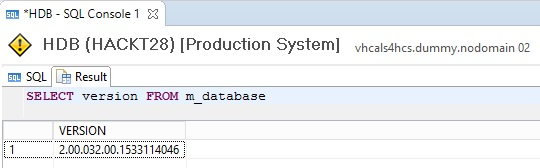

* Using the example above the plugin should be for HANA 2.0 Rev 32.0.

&nbsp;&nbsp;&nbsp;&nbsp;&nbsp;&nbsp;&nbsp;&nbsp;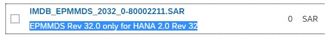

* Download the appropriate plugin version and ensure that the file (.sar) is in the same directory where you created your "SAPCAR_e.BAT" file. This was done when you worked on the Smart Data Access workflows.
* Double click on the .sar file and you should have an extracted folder in your "sapcar_out" folder.

&nbsp;&nbsp;&nbsp;&nbsp;&nbsp;&nbsp;&nbsp;&nbsp;

* Go back to your WinSCP tool and then navigate in the left panel to where you extracted your .sar file. Navigate in the right panel to the "root > usr > tmp" folder (you may need to go up one folder first) where you might see some other HANA addons or updates.

&nbsp;&nbsp;&nbsp;&nbsp;&nbsp;&nbsp;&nbsp;&nbsp;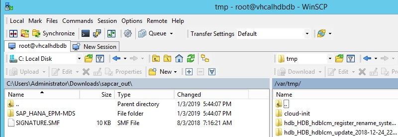

* Drag the entire SAP_HANA_EPM-MDS folder over to the "tmp" folder. 
* Right click on the folder in the "usr > tmp" directory and choose properties.

&nbsp;&nbsp;&nbsp;&nbsp;&nbsp;&nbsp;&nbsp;&nbsp;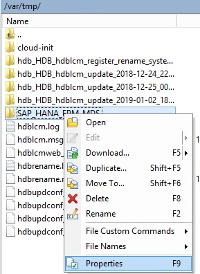

* Ensure that you change the properties similar to the following.
```
Group: sapsys [####]
Owner: hdbadm [####]

Check "Set group, owner and permissions recursively". 
```

&nbsp;&nbsp;&nbsp;&nbsp;&nbsp;&nbsp;&nbsp;&nbsp;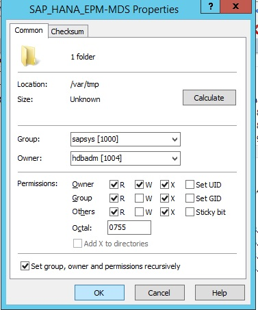

* Press OK to close the Properties dialogue.

Note that there are of course other ways to get components and updates over to your HANA system and extract them. This was hopefully the easiest way given that you are using an S/4HANA trial appliance environment.

You have now completed the step "Downloading the SAP HANA EPM-MDS Plugin".

[Go Back Up to the List of Steps](#steps)

### <a name="epmmdsinst"></a> Installing the SAP HANA EPM-MDS Plugin

In this step you will use the HANA Lifecycle Manager (LCM) to install the EPM-MDS plugin you copied to your Linux file system earlier.

* On your Windows desktop copy the following URL into a Chrome browser window.

```
URL: https://vhcalhdbdb.dummy.nodomain:1129/lmsl/HDBLCM/HDB/index.html#

User: hdbadm (a user with the necessary rights for HANA updates, installations, service restarts, etc.)
Password: the main password you used when the S/4HANA trial appliance was created
```

* You should get a "Your connection is not private" warning. Click on the "Advanced" button and then on "Proceed to vhcalhdbdb.dummy.nodomain (unsafe)". 

* Enter the user and password combo from the code block above.

* Click on the tile named "Install or Update Additional Components.

&nbsp;&nbsp;&nbsp;&nbsp;&nbsp;&nbsp;&nbsp;&nbsp;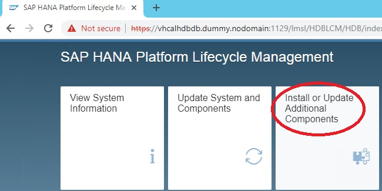

* Click on the "Add Software Components" button.

&nbsp;&nbsp;&nbsp;&nbsp;&nbsp;&nbsp;&nbsp;&nbsp;

* Navigate to the "/usr/tmp/SAP_HANA_EPM-MDS" or the directory where you copied the EPM-MDS folder and contents.

&nbsp;&nbsp;&nbsp;&nbsp;&nbsp;&nbsp;&nbsp;&nbsp;

* Press OK to close this dialogue and then press the "Add" button.

&nbsp;&nbsp;&nbsp;&nbsp;&nbsp;&nbsp;&nbsp;&nbsp;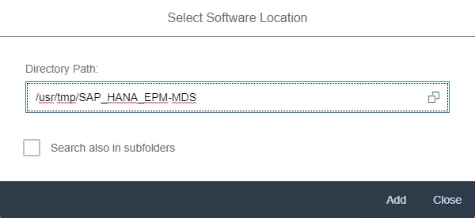

* You should see that the EPM-MDS component is recognized.

&nbsp;&nbsp;&nbsp;&nbsp;&nbsp;&nbsp;&nbsp;&nbsp;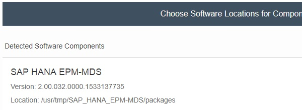

* Press Next and then check "Install SAP HANA EPM-MDS" and press Next.

&nbsp;&nbsp;&nbsp;&nbsp;&nbsp;&nbsp;&nbsp;&nbsp;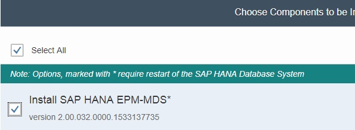

* Enter the HDBADM user password (same one as before) and press Next again.

&nbsp;&nbsp;&nbsp;&nbsp;&nbsp;&nbsp;&nbsp;&nbsp;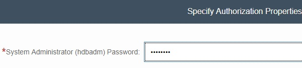

* Note the warning "During update the SAP HANA Database System will be restarted" and then press the "Update" button.
* You should see a progress screen similar to below. If not, please go back to the WinSCP steps and ensure that you set the permissions for the folder as required.

&nbsp;&nbsp;&nbsp;&nbsp;&nbsp;&nbsp;&nbsp;&nbsp;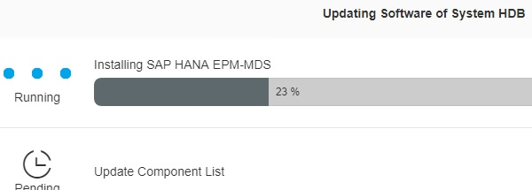

* After several minutes you should see a screen like the one below. This installation was successful and all of the HANA services have been restarted.

&nbsp;&nbsp;&nbsp;&nbsp;&nbsp;&nbsp;&nbsp;&nbsp;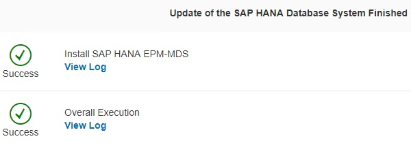

* If you now go back to the following URL, logging in as the HACKT28 user, you should see a full server info page.

```
https://vhcalhdbdb.dummy.nodomain:4302/sap/bc/ina/service/v2/GetServerInfo
```

&nbsp;&nbsp;&nbsp;&nbsp;&nbsp;&nbsp;&nbsp;&nbsp;

You have now completed the step "Installing the SAP HANA EPM-MDS Plugin".

[Go Back Up to the List of Steps](#steps)


### <a name="cors"></a> Configuring Cross Origin Resource Sharing, CORS


* xxxxxxxxxxxxxxxxxx
*
* OLD Section
*
* xxxxxxxxxxxxxxxxxx

If you are looking for info on how to set up the connection for a production environmnet then please consult [help.sap.com with a search on "SAP Analytics Cloud Live Data Connections to SAP HANA".](https://help.sap.com/viewer/search?q=SAP%20Analytics%20Cloud%20Live%20Data%20Connections%20to%20SAP%20HANA)


######

* port 443 (& optional 44301) must be opened in firewall

To open a port in the Windows firewall for TCP access
On the Start menu, click Run, type WF.msc, and then click OK.
In the Windows Firewall with Advanced Security, in the left pane, right-click Inbound Rules, and then click New Rulein the action pane (upper right corner).


* ina config...if necessary???

http://vhcalhdbdb.dummy.nodomain:8002/sap/hana/xs/admin/#/package/sap.bc.ina.service

* use sql console instead of above
```
UPDATE "_SYS_XS"."RUNTIME_CONFIGURATION" 
SET "CONFIGURATION" = ' {"cors":{
	"enabled":true,
	"allowOrigin":["https://sha.us2.sapanalytics.cloud"],
	"exposeHeaders":["x-csrf-token"],
	"allowHeaders":["accept-language",
	"x-sap-cid","x-request-with",
	"x-csrf-token","content-type",
	"authorization","accept"],
	"allowMethods":["GET","HEAD","POST","OPTIONS"],
	"maxAge":3600}}' 
WHERE "PACKAGE_ID" = 'sap.bc.ina.service.v2';
```


######

```
code block
```


You have now completed the step "######" and are done with the whole task of "Creation of Connection and Models and Story in SAP Analytics Cloud". You have also completed the entire exercise...congratulations!

[Go Back to the Main Page](../demoHowTo.md)

[Go Back Up to the List of Steps](#steps)
