<table width=100% border=>
<tr><td colspan=2><h1>How to Extend S/4HANA with HANA Spatial and SAC</h1></td></tr>
<tr><td><h3>Setup of Sample Spatial Data for the SAP HANA System</h3></td><td width=60%></br>&nbsp;Task #4, Using Eclipse IDE, HANA Development Perspective</p></td></tr>
</table>

## Description

In the next steps you will import and configure a sample set of tables for the HANA database. Numeric columns consisting of longitudes and latitudes will be transformed into spatial-type data that can be consumed later in the SAP Analytics Cloud. 

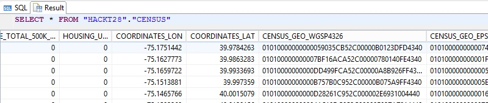

## Prerequisites

You should have completed all of the exercise [Prerequisites](../exercises/preReqs.md). You should have also completed [Task 3: Setup of Smart Data Access to the S/4HANA System](sdiConfig.md) using Data Provisioning and the Eclipse IDE.

## Steps

You will need to use the HANA Development Perspective in Eclipse as the HACKT28 user. Data in the form of a .csv export from HANA will be imported into your database.  In several steps the data will be readied so that Calculation Views with HANA Spatial features can be built against the new tables and the virtualized S/4HANA data.

1. [Import of Sample Data into HANA](#hdbdimp)

2. [Creation of HANA Spatial-Type Columns](#hdbdstc)

3. [Creation of EPSG (SRID 3857) Spatial System](#hdbdess) 
 
4. [Transform of HANA Spatial Data into EPSG Type](#hdbdetss)
 
### <a name="hdbdimp"></a> Import of Sample Data into HANA

There are two tables of sample data that will be imported into your HANA system. One table is a US Census table and the other table will be used to perform a simple geocoding of the customer addresses from the S/4HANA system. The geocoding in this case is approximating the location using the centroid of its zipcode approximation so it is useful from a "how to" / demo perspective but not for accuracy. If you are interested in more information on geocoding please go to [help.sap.com] and search on "geocode".(https://help.sap.com/viewer/search?q=geocode)

* Copy the [link address for the sample data download from here](https://goo.gl/k9ydJV) and download the .zip file and extract the contents.

* Go to Eclipse > SAP HANA Development perspective > and right click on the HACKT28 schema in your HACKT28 user's connection. Choose "Import".

&nbsp;&nbsp;&nbsp;&nbsp;&nbsp;&nbsp;&nbsp;&nbsp;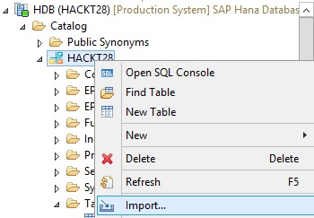

* Browse to the Windows folder where you extracted the data and select the folder one level up from the "index" folder. Press the "Next" button.

&nbsp;&nbsp;&nbsp;&nbsp;&nbsp;&nbsp;&nbsp;&nbsp;

* Add both of the Catalog Objects. These are both tables that were exported from a HANA database. Press the "Next" button.

&nbsp;&nbsp;&nbsp;&nbsp;&nbsp;&nbsp;&nbsp;&nbsp;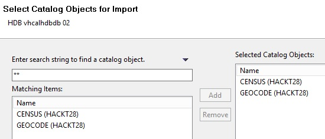

* In this case the only required option is to choose to import the data and you can increase the number of threads used for the import if you wish. This particular data import is not that large. Note that if you are using a production based system and want to find out more about data imports / loads then please see [the blog post here.](https://blogs.saphana.com/2013/04/07/best-practices-for-sap-hana-data-loads/)

&nbsp;&nbsp;&nbsp;&nbsp;&nbsp;&nbsp;&nbsp;&nbsp;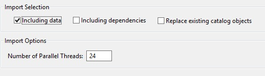

* After you press "Finish" you will most likely need to right click on your Tables folder and choose Refresh. Now if you choose "Open Data Preview" for the Geocode table then you should see that there are two columns (they are decimal type) for longitude and latitude. In the next steps you will be creating spatial-type columns in your new tables, based on these columns.

&nbsp;&nbsp;&nbsp;&nbsp;&nbsp;&nbsp;&nbsp;&nbsp;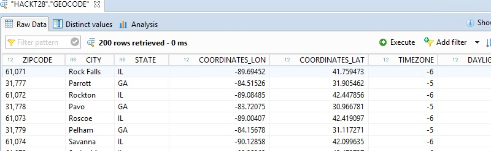

You have now completed the step "Import of Sample Data into HANA".

[Go Back Up to the List of Steps](#steps)

### <a name="hdbdstc"></a> Creation of HANA Spatial-Type Columns

Using the Geocode table as an example, you will add a new spatial-type column and then populate that column by converting the longitude and latitude decimal type columns. Note that this new column will be a planar type spatial column with a system ID of 1000004326. The system that you will use in SAP Analytics Cloud exercise is EPSG 3857 and this system needs to be added to HANA. 

The existing decimal data could of course be converted directly into EPSG after adding that system, so the next minor steps are just to give a quick overview of converting longitude latitude data into an existing spatial system (planar WGS84 1000004326) in HANA. 

Earlier you previewed the Geocode table and saw the decimal type columns. Those coordinates represent the centroid for the corresponding zipcode. Please note that these zipcode coordinates are only approximated using publicly available US Census tract data.

* If you want to convert two numeric columns on the fly into a spatial point, the ST_GeomFromText function can be used. Open a new SQL Console from your HACKT28 schema and then run the following code in the Console.
```
SELECT  
	"ZIPCODE", 
	"COORDINATES_LON",
	"COORDINATES_LAT",
	ST_GeomFromText( 'Point(' || "COORDINATES_LON" || ' ' || "COORDINATES_LAT" || ')', 1000004326 ) 
		as "POINT_BINARY",
	ST_GeomFromText( 'Point(' || "COORDINATES_LON" || ' ' || "COORDINATES_LAT" || ')', 1000004326 ).ST_AsWKT() 
		as "POINT_TEXT"
FROM "HACKT28"."GEOCODE"; 
```

* The Point_Binary column shows what the conversion looks like in a raw format and the Point_Text shows what it looks like after converting this to a "well known text" format.


&nbsp;&nbsp;&nbsp;&nbsp;&nbsp;&nbsp;&nbsp;&nbsp;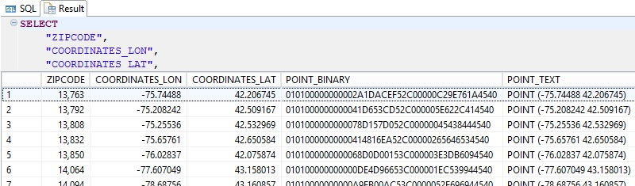

* Given that you can use spatial type functions in HANA to construct spatial data on the fly, this is not considered a best practice. The best practice is to store your spatial data in HANA as the desired spatial type. One of the reasons to do this is of course for performance. If you run the next bit of code you will add a new Spatial Type column to your Geocode table. This new column will have a spatial type of 1000004326 which is a planar type as opposed to a spheroid type. Each system will have its own advantages and disadvantages such as the planar type may run some calculations faster but distances between points may not be as accurate as some spheroidal systems. 

```
ALTER TABLE "HACKT28"."GEOCODE"
ADD ("ZIPCODE_WGSP4326" ST_POINT(1000004326));
```

* After running the above "alter table" code, run the "update" code below which will populate the Geocode table's new spatial type column. Note that the ST_GeomFromText function syntax is the same as what you ran earlier.

```
UPDATE "HACKT28"."GEOCODE"
SET "ZIPCODE_WGSP4326" = 
 	ST_GeomFromText( 'Point(' || "COORDINATES_LON" || ' ' || "COORDINATES_LAT" || ')', 1000004326 );
```

* Run the following "select" statement and you will now see the Geocode table with its new spatial data corresponding to the longitude and latitude of the zipcode centroid.

```
SELECT * FROM "HACKT28"."GEOCODE";
```

&nbsp;&nbsp;&nbsp;&nbsp;&nbsp;&nbsp;&nbsp;&nbsp;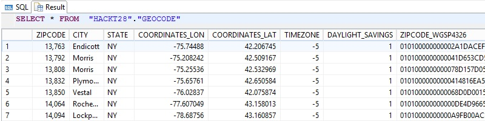

* The second table that you will add a spatial column to is a Census table that has socio-economic statistics aggregated at the zipcode level. This table will be used to supply statistical data within a radius from each customer location. Copy the syntax below and run the entire code block. After a bit and after scrolling to the far right of the table you will see that the Census table has a new spatial column (Census_Geo_WBSP4326) that has been populated with the same conversion method you used before.

```
ALTER TABLE "HACKT28"."CENSUS"
ADD ("CENSUS_GEO_WGSP4326" ST_POINT(1000004326));

UPDATE "HACKT28"."CENSUS"
SET "CENSUS_GEO_WGSP4326" = 
 	ST_GeomFromText( 'Point(' || "COORDINATES_LON" || ' ' || "COORDINATES_LAT" || ')', 1000004326 );
 	
SELECT * FROM "HACKT28"."CENSUS"; 
```

&nbsp;&nbsp;&nbsp;&nbsp;&nbsp;&nbsp;&nbsp;&nbsp;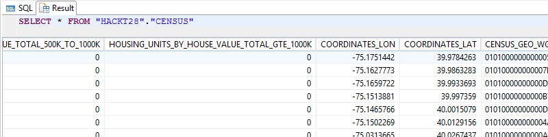

You have now completed the step "Creation of HANA Spatial-Type Columns".

[Go Back Up to the List of Steps](#steps)


### <a name="hdbdess"></a> Creation of EPSG (SRID 3857) Spatial System

At the time of writing of this exercise, SAP HANA had a limited number of spatial systems installed by default and the type EPSG 3857 was not one of those. In this step this spatial system will be added to HANA. 

Some web mapping and visualization applications such as Google Earth, Bing Maps, and ArcGIS Online, use this system that is based on a spherical model of the Earth. As mentioned earlier, each system has advantages and disadvantages. This one ignores flattening at the Earth's poles which can lead to errors of up to 800m in position but it also allows for faster projections.

* As the HACKT28 user run the following syntax in your SQL Console. You should have several Spatial Reference Systems including the WGS84 (4326 spheroid, 1000004326 planar) in your HANA system. World Geodedic System (WGS) 84 SRS 4326 is used for Global Positioning System / GPS. Note that SRS 0 is a Cartesian system. For more info see this [tutorial on Spatial Reference Systems.](https://developers.sap.com/tutorials/hana-spatial-intro6-srs.html)

```
SELECT * FROM "SYS"."ST_SPATIAL_REFERENCE_SYSTEMS";
```

&nbsp;&nbsp;&nbsp;&nbsp;&nbsp;&nbsp;&nbsp;&nbsp;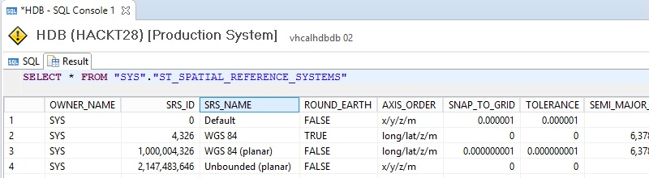

* As the HACKT28 user run the following Create Spatial Reference System syntax in your SQL Console. 

```
CREATE SPATIAL REFERENCE SYSTEM "WGS 84 / Pseudo-Mercator" IDENTIFIED BY 3857
TYPE PLANAR
SNAP TO GRID 1e-4
TOLERANCE 1e-4
COORDINATE X BETWEEN -20037508.3427892447 AND 20037508.3427892447
COORDINATE Y BETWEEN -19929191.7668547928 AND 19929191.766854766
ORGANIZATION "EPSG" IDENTIFIED BY 3857
LINEAR UNIT OF MEASURE "metre"
ANGULAR UNIT OF MEASURE NULL
POLYGON FORMAT 'EvenOdd'
STORAGE FORMAT 'Internal'
DEFINITION 'PROJCS["Popular Visualisation CRS / Mercator",GEOGCS["Popular Visualisation CRS",DATUM["Popular_Visualisation_Datum",SPHEROID["Popular Visualisation Sphere",6378137,0,AUTHORITY["EPSG","7059"]],TOWGS84[0,0,0,0,0,0,0],AUTHORITY["EPSG","6055"]],PRIMEM["Greenwich",0,AUTHORITY["EPSG","8901"]],UNIT["degree",0.01745329251994328,AUTHORITY["EPSG","9122"]],AUTHORITY["EPSG","4055"]],UNIT["metre",1,AUTHORITY["EPSG","9001"]],PROJECTION["Mercator_1SP"],PARAMETER["central_meridian",0],PARAMETER["scale_factor",1],PARAMETER["false_easting",0],PARAMETER["false_northing",0],AUTHORITY["EPSG","3785"],AXIS["X",EAST],AXIS["Y",NORTH]]'
TRANSFORM DEFINITION '+proj=merc +a=6378137 +b=6378137 +lat_ts=0.0 +lon_0=0.0 +x_0=0.0 +y_0=0 +k=1.0 +units=m +nadgrids=@null +wktext  +no_defs';

SELECT * FROM "SYS"."ST_SPATIAL_REFERENCE_SYSTEMS";
```

* The WGS 84 / Pseudo-Mercator (3857) system should be available. 

&nbsp;&nbsp;&nbsp;&nbsp;&nbsp;&nbsp;&nbsp;&nbsp;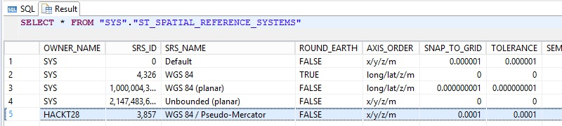

You have now completed the step "Creation of EPSG (SRID 3857) Spatial System".

[Go Back Up to the List of Steps](#steps)

### <a name="hdbdetss"></a> Transform of HANA Spatial Data into EPSG Type

In this major step you will add new spatial columns to the two tables, where those new columns will use the EPSG 3857 system that was just added. You will also use the ST_Transform HANA Spatial function which will transform existing WGS84 1000004326 spatial data into 3857.

* To see how the ST_Transform function works, run the following code in a SQL Console as the HACKT28 user. 

```
SELECT  
	"ZIPCODE", 
	"COORDINATES_LON",
	"COORDINATES_LAT",
	"ZIPCODE_WGSP4326",
	"ZIPCODE_WGSP4326".ST_Transform(3857),
	"ZIPCODE_WGSP4326".ST_AsWKT(),
	"ZIPCODE_WGSP4326".ST_Transform(3857).ST_AsWKT()
FROM "HACKT28"."GEOCODE"; 
```

* Note that there are two columns using the transform where the first returns the binary data and the second returns the transformed data as well known text.

&nbsp;&nbsp;&nbsp;&nbsp;&nbsp;&nbsp;&nbsp;&nbsp;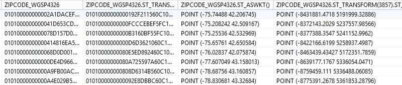

* Similar to what you did earlier to add in a new spatial column, copy the code below and run it in your SQL Console. This time the new spatial column will have an SRS ID of 3857 and the ST_Transform function is used instead of ST_GeomFromText which was used on the two decimal columns.


```
ALTER TABLE "HACKT28"."GEOCODE"
ADD ("ZIPCODE_EPSG3857" ST_POINT(3857));

UPDATE "HACKT28"."GEOCODE"
SET "ZIPCODE_EPSG3857" = 
	"ZIPCODE_WGSP4326".ST_Transform(3857);
```	

* Now run the following "select" statement. As mentioned earlier, there are spatial functions that can construct spatial data such as points on the fly. However, it is often better to store data as the desired spatial type in HANA to take advantage of better performance. In the case of this exercise, there is a planar WGS84 column that will not end up being used later on. It was added to this exercise only to show usage of a default spatial system in HANA and how to transform from this existing system.

```	
SELECT * FROM "HACKT28"."GEOCODE";
```

&nbsp;&nbsp;&nbsp;&nbsp;&nbsp;&nbsp;&nbsp;&nbsp;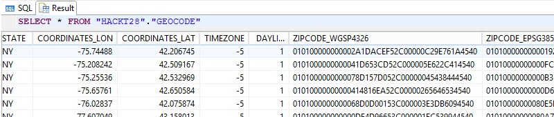

* To accomplish the same goal with the Census table, run the following code in your SQL Console. Scroll to the far right of the results to see the new 3857 column.

```
ALTER TABLE "HACKT28"."CENSUS"
ADD ("CENSUS_GEO_EPSG3857" ST_POINT(3857));

UPDATE "HACKT28"."CENSUS"
SET "CENSUS_GEO_EPSG3857" = 
	"CENSUS_GEO_WGSP4326".ST_Transform(3857);
	
SELECT * FROM "HACKT28"."CENSUS";
```

&nbsp;&nbsp;&nbsp;&nbsp;&nbsp;&nbsp;&nbsp;&nbsp;

If you want to redo the above parts of the exercise, the following syntax will remove the different objects you created.

* The following syntax, when uncommented, removes the new columns from the two tables.

```
/*
alter table "HACKT28"."GEOCODE"
drop ("ZIPCODE_WGSP4326", "ZIPCODE_EPSG3857");

alter table "HACKT28"."CENSUS"
drop "CENSUS_GEO_WGSP4326", "CENSUS_GEO_EPSG3857");
*/
```

* The following, when uncommented, removes the WGS 84 / Pseudo-Mercator Spatial Reference System.

```
--DROP SPATIAL REFERENCE SYSTEM "WGS 84 / Pseudo-Mercator";
```

You have now completed the step "Creation of EPSG (SRID 3857) Spatial System" and are done with the whole task of "Setup of Sample Spatial Data for the SAP HANA System".

Your next task is to create Calculation Views on combined S/4HANA and Census data.

[Go to Task 5: Creation of HANA Calculation Views on Integrated Data](hdbViews.md)

[Go Back to the Main Page](../demoHowTo.md)

[Go Back Up to the List of Steps](#steps)
