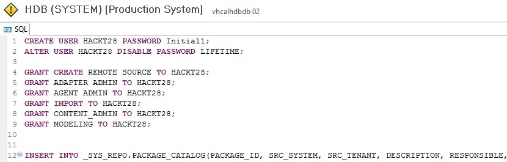
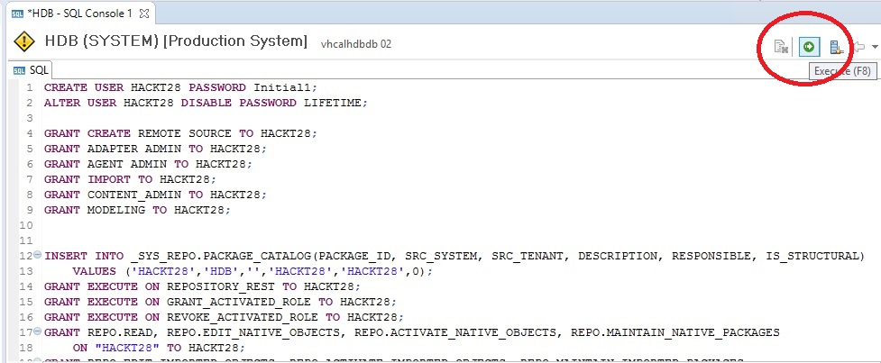

<table width=100% border=>
<tr><td colspan=2><h1>How to Extend S/4HANA with HANA Spatial and SAC</h1></td></tr>
<tr><td><h3>Creation of Development User for the SAP HANA System</h3></td><td width=60%></br>&nbsp;Task #2, Using Eclipse IDE, HANA Development Perspective</p></td></tr>
</table>


## Description

In the next steps you will create a technical HANA database user that has the rights to create remote connections and tables, import objects, create Calculation Views, etc.





## Prerequisites

You should have completed all of the exercise [Prerequisites](../exercises/preReqs.md). You should have also completed [Task 1: Creation of CDS Views in S/4HANA](../exercises/s4hViews.md) using the Eclipse IDE.

## Steps

You will need to use the HANA Development Perspective in Eclipse as an admin user. This admin user will have the rights to create the new development user that will complete a lot of the upcoming tasks in the HANA environment. 

1. [Logging into HANA as an Admin User](#hdbadmin)

1. [Creating the Development User with a Script](#hdbdev)

1. [Granting Rights to the Developmnent User's Project](#hdbrepo)


### <a name="hdbadmin"></a> Logging into HANA as an Admin User

* In Eclipse click on the Open Perspective shortcut to get the full list of Perspectives. (Perspectives are also accessible through the Window menu > Perspective > Open Perspective > Other.)

&nbsp;&nbsp;&nbsp;&nbsp;&nbsp;&nbsp;&nbsp;&nbsp;

* Select the SAP HANA Development Perspective. Note that there are a couple other Perspectives that you could use for the next tasks such as the SAP HANA Administration Console. However you are also going to be creating some HANA Calculation Views so this Perspective is a good catch-all for these HANA related tasks.

&nbsp;&nbsp;&nbsp;&nbsp;&nbsp;&nbsp;&nbsp;&nbsp;

* Now go to the Systems tab.

&nbsp;&nbsp;&nbsp;&nbsp;&nbsp;&nbsp;&nbsp;&nbsp;

* You should see an entry for the System user connection to the local HANA system. If not don't worry as a bit further down we'll show you how to create a new connection when the Systems panel is empty. 

&nbsp;&nbsp;&nbsp;&nbsp;&nbsp;&nbsp;&nbsp;&nbsp;

* Right click on the System user connection and choose Log On.

* The System user has the same password that you use in your Windows remote connection. This is the password that you created when creating the trial solution in the SAP Cloud Appliance Library. To avoid the logon step the next time make sure that the "Store user name and password..." option is selected.

&nbsp;&nbsp;&nbsp;&nbsp;&nbsp;&nbsp;&nbsp;&nbsp;

* If you didn't see a System user connection in the Systems panel, then right click anywhere in that panel and choose Add System.

&nbsp;&nbsp;&nbsp;&nbsp;&nbsp;&nbsp;&nbsp;&nbsp;

* If you are using the S/4HANA trial then add the following information.

&nbsp;&nbsp;&nbsp;&nbsp;&nbsp;&nbsp;&nbsp;&nbsp;

* Note that the aliases for the S/4HANA appliance can be found in the hosts file on your Windows client. In a File Explorer go to this folder: C:\Windows\System32\drivers\etc

&nbsp;&nbsp;&nbsp;&nbsp;&nbsp;&nbsp;&nbsp;&nbsp;

&nbsp;&nbsp;&nbsp;&nbsp;&nbsp;&nbsp;&nbsp;&nbsp;

* Add the SYSTEM user and password where the password is the one you created in the Cloud Appliance Library and is the same one for the Windows client administrator login.

&nbsp;&nbsp;&nbsp;&nbsp;&nbsp;&nbsp;&nbsp;&nbsp;

Note that you are logged in as a System user as this is a demo exercise. It is a best practice to use it only to create users with less privileges and then deactivate the System user. Please go to help.sap.com and search on "SAP HANA Security" for more information on these topics. 

You have now completed this step.

[Go Back Up to the List of Steps](#steps)

### <a name="hdbdev"></a> Creating the Development User with a Script

As you are now connected to your HANA database you should also see your S/4HANA / ERP schema. Note that you will not be modifying or adding to this schema in any way in the HANA development parts of this exercise. 

* If you were to expand this schema and then right click on the Views folder to add a Filter of ZXSH then you would see the views you created earlier.

&nbsp;&nbsp;&nbsp;&nbsp;&nbsp;&nbsp;&nbsp;&nbsp;

&nbsp;&nbsp;&nbsp;&nbsp;&nbsp;&nbsp;&nbsp;&nbsp;


&nbsp;&nbsp;&nbsp;&nbsp;&nbsp;&nbsp;&nbsp;&nbsp;

&nbsp;&nbsp;&nbsp;&nbsp;&nbsp;&nbsp;&nbsp;&nbsp;


* Paste in the following code into the new SQL Console and then press the Execute button or your F8 key. If you get a warning about running the code you can close it.


```
CREATE USER HACKT28 PASSWORD Initial1;
ALTER USER HACKT28 DISABLE PASSWORD LIFETIME;

GRANT CREATE REMOTE SOURCE TO HACKT28;
GRANT ADAPTER ADMIN TO HACKT28;
GRANT AGENT ADMIN TO HACKT28;
GRANT IMPORT TO HACKT28;
GRANT CONTENT_ADMIN TO HACKT28;
GRANT MODELING TO HACKT28;


INSERT INTO _SYS_REPO.PACKAGE_CATALOG(PACKAGE_ID, SRC_SYSTEM, SRC_TENANT, DESCRIPTION, RESPONSIBLE, IS_STRUCTURAL) 
	VALUES ('HACKT28','HDB','','HACKT28','HACKT28',0);
GRANT EXECUTE ON REPOSITORY_REST TO HACKT28;
GRANT EXECUTE ON GRANT_ACTIVATED_ROLE TO HACKT28;
GRANT EXECUTE ON REVOKE_ACTIVATED_ROLE TO HACKT28;
GRANT REPO.READ, REPO.EDIT_NATIVE_OBJECTS, REPO.ACTIVATE_NATIVE_OBJECTS, REPO.MAINTAIN_NATIVE_PACKAGES 
	ON "HACKT28" TO HACKT28;
GRANT REPO.EDIT_IMPORTED_OBJECTS, REPO.ACTIVATE_IMPORTED_OBJECTS, REPO.MAINTAIN_IMPORTED_PACKAGES 
	ON "HACKT28" TO HACKT28;
```

You now have created a development user, HACKT28 with a password of Initial1 that doesn't expire. We disabled the "password lifetime" as this is a demo user. Note the options that we granted the new user including the ability to create Remote Sources and administer adapters. The user can also do modeling tasks as well as create other content. We also created a development package for the new user and granted the necessary rights to the repository to the user.

[Go Back Up to the List of Steps](#steps)


* Run this as HACKT28

```
GRANT SELECT, INSERT, UPDATE, DELETE, EXECUTE ON SCHEMA HACKT28 to _SYS_REPO WITH GRANT OPTION;
```

[Go Back to the Main Page](../demoHowTo.md)

[Go Back Up to the List of Steps](#steps)
