<table width=100% border=>
<tr><td colspan=2><h1>How to Extend S/4HANA with HANA Spatial and SAC</h1></td></tr>
<tr><td><h3>Creation of Development User for the SAP HANA System</h3></td><td width=60%></br>&nbsp;Task #2, Using Eclipse IDE, HANA Development Perspective</p></td></tr>
</table>

## Description

In the next steps you will create a technical HANA database user that has the rights to create remote connections and tables, import objects, create Calculation Views, etc.

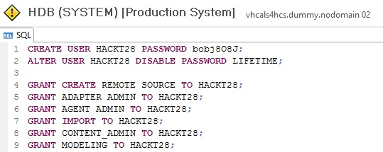

## Prerequisites

You should have completed all of the exercise [Prerequisites](../exercises/preReqs.md). You should have also completed [Task 1: Creation of a CDS View in S/4HANA](../exercises/s4hViews.md) using the Eclipse IDE.

## Steps

You will need to use the HANA Development Perspective in Eclipse as an admin user. This admin user will have the rights to create the new development user that will complete a lot of the upcoming tasks in the HANA environment. 

1. [Logging into HANA as an Admin User](#hdbadmin)

1. [Creating the Development User with a Script](#hdbdev)

1. [Granting Rights to the Development User's Project](#hdbrepo)


### <a name="hdbadmin"></a> Logging into HANA as an Admin User

* In Eclipse click on the Open Perspective shortcut to get the full list of Perspectives. Perspectives are also accessible through the Window menu > Perspective > Open Perspective > Other.

&nbsp;&nbsp;&nbsp;&nbsp;&nbsp;&nbsp;&nbsp;&nbsp;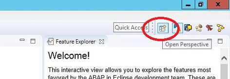

* Select the SAP HANA Development Perspective. Note that there are a couple other Perspectives that you could use for the next tasks such as the SAP HANA Administration Console. However you are also going to be creating some HANA Calculation Views so this Perspective is a good catch-all for these HANA related tasks.

&nbsp;&nbsp;&nbsp;&nbsp;&nbsp;&nbsp;&nbsp;&nbsp;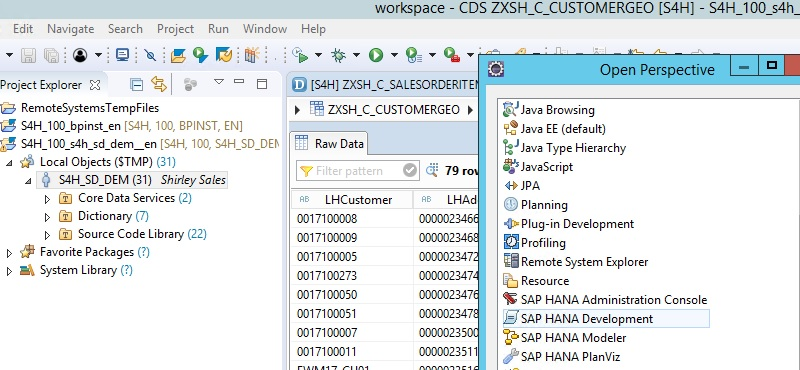

* Now go to the Systems tab.

&nbsp;&nbsp;&nbsp;&nbsp;&nbsp;&nbsp;&nbsp;&nbsp;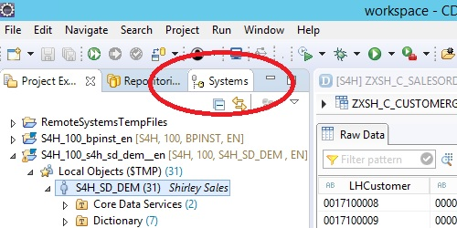

* You should see an entry for the System user connection to the local HANA system. If not don't worry as a bit further down we'll show you how to create a new connection when the Systems panel is empty. 

&nbsp;&nbsp;&nbsp;&nbsp;&nbsp;&nbsp;&nbsp;&nbsp;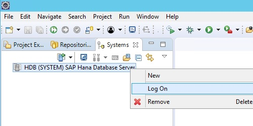

* If you're using a later version such as the SAP S/4HANA 1809, Fully-Activated Appliance then you might see a couple of system user connections, one for the system database and one for the tenant database. The tenant connection is the one you'll be interested in for these steps.

&nbsp;&nbsp;&nbsp;&nbsp;&nbsp;&nbsp;&nbsp;&nbsp;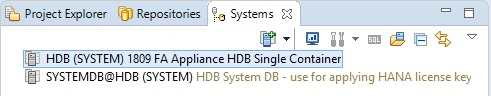

* Right click on the System user (tenant) connection and choose "Log On".

* The System user has the same password that you use in your Windows remote connection. This is the password that you created when creating the trial solution in the SAP Cloud Appliance Library. To avoid the logon step the next time make sure that the "Store user name and password..." option is selected.

&nbsp;&nbsp;&nbsp;&nbsp;&nbsp;&nbsp;&nbsp;&nbsp;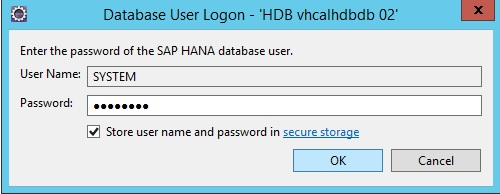

* If you didn't see a System user connection in the Systems panel, then right click anywhere in that panel and choose "Add System".

&nbsp;&nbsp;&nbsp;&nbsp;&nbsp;&nbsp;&nbsp;&nbsp;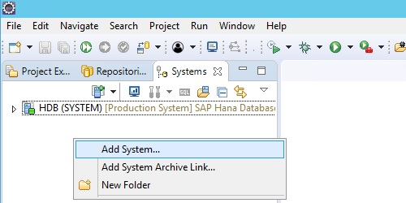

* If you are using the S/4HANA trial then add the following information and then click on "Next".

&nbsp;&nbsp;&nbsp;&nbsp;&nbsp;&nbsp;&nbsp;&nbsp;

* Note that the aliases for the S/4HANA appliance can be found in the hosts file on your Windows client. If you want to have a look at this, in the Windows' File Explorer go to the folder path shown below and open the "hosts" file with Notepad.

```
C:\Windows\System32\drivers\etc
```

&nbsp;&nbsp;&nbsp;&nbsp;&nbsp;&nbsp;&nbsp;&nbsp;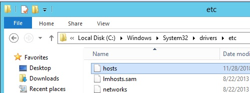

&nbsp;&nbsp;&nbsp;&nbsp;&nbsp;&nbsp;&nbsp;&nbsp;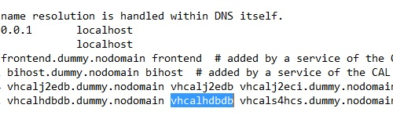

* Add the SYSTEM user and password where the password is the one you created in the Cloud Appliance Library and is the same one for the Windows client administrator login. Then click on "Finish".

&nbsp;&nbsp;&nbsp;&nbsp;&nbsp;&nbsp;&nbsp;&nbsp;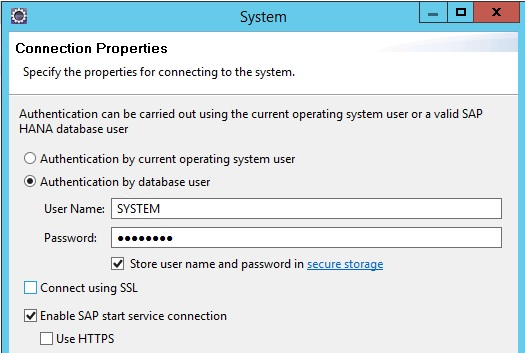

Note that you are logged in as a System user as this is a demo exercise. It is a best practice to use it only to create users with less privileges and then deactivate the System user. Please go to [help.sap.com](https://help.sap.com/viewer/search?q=SAP%20HANA%20Security%20Guide) and search on "SAP HANA Security Guide" for more information on these topics. 

Also note that we are not providing direct links to help.sap.com pages in this exercise as the final direct urls are subject to change. Sorry about that.

You have now completed the step "Logging into HANA as an Admin User".

[Go Back Up to the List of Steps](#steps)

### <a name="hdbdev"></a> Creating the Development User with a Script

As you are now connected to your HANA database you should also see your S/4HANA / ERP schema. Note that you will not be modifying or adding to this schema in any way in the HANA development parts of this exercise. 

&nbsp;&nbsp;&nbsp;&nbsp;&nbsp;&nbsp;&nbsp;&nbsp;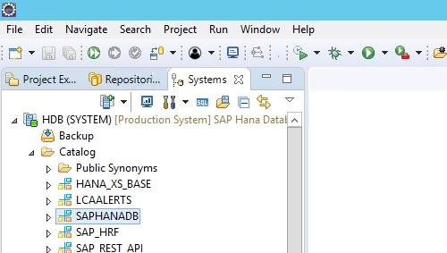

* If you were to expand this schema and then right click on the Views folder to add a Filter of ZXSH then you would see the view you created earlier. You will not be able to preview the data from these views in this perspective as the system user although you can look at their "Create Statements" via right clicking and selecting "Open Definition". This is due to S/4HANA security vs. that of the HANA database.

&nbsp;&nbsp;&nbsp;&nbsp;&nbsp;&nbsp;&nbsp;&nbsp;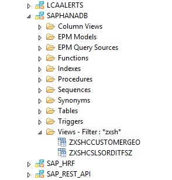

* Right click on the HDB (SYSTEM) Catalog and choose "Open SQL Console".

&nbsp;&nbsp;&nbsp;&nbsp;&nbsp;&nbsp;&nbsp;&nbsp;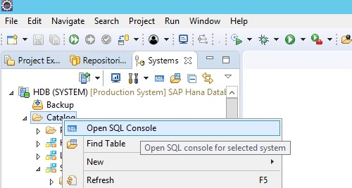

* Paste in the following code into the new SQL Console. First change "XXXXXX" to the desired password and then press the Execute button or your F8 key.

```
CREATE USER HACKT28 PASSWORD XXXXXX;
ALTER USER HACKT28 DISABLE PASSWORD LIFETIME;

GRANT CREATE REMOTE SOURCE TO HACKT28;
GRANT ADAPTER ADMIN TO HACKT28;
GRANT AGENT ADMIN TO HACKT28;
GRANT IMPORT TO HACKT28;
GRANT CONTENT_ADMIN TO HACKT28;
GRANT MODELING TO HACKT28;

GRANT EXECUTE ON REPOSITORY_REST TO HACKT28;
GRANT EXECUTE ON GRANT_ACTIVATED_ROLE TO HACKT28;
GRANT EXECUTE ON REVOKE_ACTIVATED_ROLE TO HACKT28;

INSERT INTO _SYS_REPO.PACKAGE_CATALOG(PACKAGE_ID, SRC_SYSTEM, SRC_TENANT, DESCRIPTION, RESPONSIBLE, IS_STRUCTURAL) 
	VALUES ('HACKT28','HDB','','HACKT28','HACKT28',0);
GRANT REPO.READ, REPO.EDIT_NATIVE_OBJECTS, REPO.ACTIVATE_NATIVE_OBJECTS, REPO.MAINTAIN_NATIVE_PACKAGES 
	ON "HACKT28" TO HACKT28;
GRANT REPO.EDIT_IMPORTED_OBJECTS, REPO.ACTIVATE_IMPORTED_OBJECTS, REPO.MAINTAIN_IMPORTED_PACKAGES 
	ON "HACKT28" TO HACKT28;
	
CALL "GRANT_ACTIVATED_ROLE"('sap.bc.ina.service.v2.userRole::INA_USER', 'HACKT28');	

CALL "GRANT_ACTIVATED_ROLE"('sap.hana.xs.admin.roles::RuntimeConfAdministrator', 'HACKT28'); 
CALL "GRANT_ACTIVATED_ROLE"('sap.hana.xs.admin.roles::SAMLViewer', 'HACKT28');
```

&nbsp;&nbsp;&nbsp;&nbsp;&nbsp;&nbsp;&nbsp;&nbsp;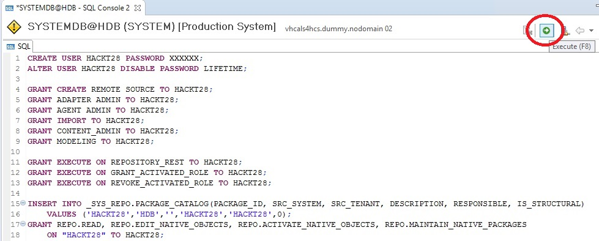

* You now have created a development user, HACKT28 with a password that doesn't expire or need to be changed when that user first logs on. The "password lifetime" was disabled as this is a demo user on a trial system. A development package was also created for the HACKT28 user.

* The other options that you granted the new user include the ability to create Remote Sources and administer Adapters. These are important for making the connection between the S/4HANA system and the HANA database. The user can also do modeling tasks as well as create other content. You also granted the necessary rights to the repository to the user which are needed for saving and activating Calculation Views.

* Note the CALL to the GRANT_ACTIVATED_ROLE procedures. The first "INA_USER" call will assign a role to the HACKT28 user to use a live connection from the SAP Analytics Cloud to the SAP HANA database. This role is required in addition to the usual roles and authorizations that are granted to users for data access purposes.

* The other CALLs are so that the HACKT28 user can access a web based admin tool and make changes to the HANA Info Access (InA) service. Cross Origin Resource Sharing (CORS) changes need to be done so that the SAP Analytics Cloud has access to HANA resources such as Calculation Views. This is covered further in Task 6: Setup of the SAP HANA System for Resource Sharing.

As previously mentioned, please go to [help.sap.com](https://help.sap.com/viewer/search?q=SAP%20HANA%20Security%20Guide) and search in "SAP HANA Security Guide" for more information on user security topics. 

You have now completed the step "Creating the Development User with a Script".

[Go Back Up to the List of Steps](#steps)

### <a name="hdbrepo"></a> Granting Rights to the Development User's Project

One more step in readying the development user's HANA environment is to grant access to HACKT28's development repo to the _SYS_REPO user. This is a technical owner which owns all of the objects in the repository. When our development user designs Calculation Views they need to be activated in order to be used as run-time repository objects. Therefore if you don't do this particular task then when you try to activate your Calculation Views you will get an error. If you want more info on this topic go to [help.sap.com](https://help.sap.com/viewer/search?q=_sys_repo%20authorization) and search on "_sys_repo authorization".

* You need to first add a HANA system connection for the HACKT28 user. Right click on the existing SYSTEM user's connection and choose "Add System with Different User".

&nbsp;&nbsp;&nbsp;&nbsp;&nbsp;&nbsp;&nbsp;&nbsp;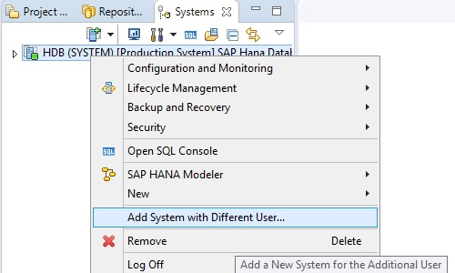

* Enter in HACKT28 and the password you used in the "Create User" script earlier and press Finish.

&nbsp;&nbsp;&nbsp;&nbsp;&nbsp;&nbsp;&nbsp;&nbsp;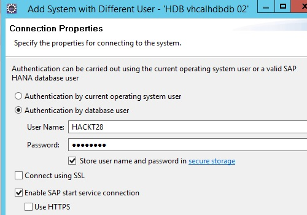

* You can now see the HACKT28's schema and self-named project that were made with the "Create User" script. We will be using these later to add our tables and Calculation Views.

&nbsp;&nbsp;&nbsp;&nbsp;&nbsp;&nbsp;&nbsp;&nbsp;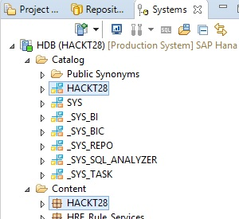

* Right click on the HACKT28 system and choose "Open SQL Console".

&nbsp;&nbsp;&nbsp;&nbsp;&nbsp;&nbsp;&nbsp;&nbsp;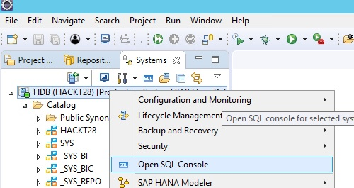

* Copy the following code and paste it into the SQL Console. 

```
GRANT SELECT, INSERT, UPDATE, DELETE, EXECUTE 
ON SCHEMA HACKT28 to _SYS_REPO WITH GRANT OPTION;
```

* Press the Executive button or your F8 key. If you get a warning about running the code then click on Yes to continue.

&nbsp;&nbsp;&nbsp;&nbsp;&nbsp;&nbsp;&nbsp;&nbsp;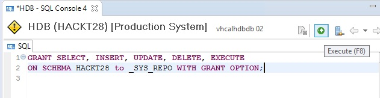

The _SYS_REPO will now have access to the Calculation Views that you will create later on. 

You have now completed the step "Granting Rights to the Development User's Project" and are done with the whole task of "Creation of Developer User for the SAP HANA System".

[Go to Task 3: Setup of Smart Data Access to the S/4HANA System](sdiConfig.md)

[Go Back to the Main Page](../demoHowTo.md)

[Go Back Up to the List of Steps](#steps)
