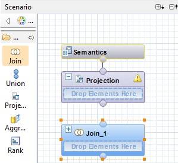
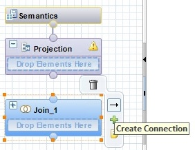
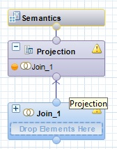

<table width=100% border=>
<tr><td colspan=2><h1>How to Extend S/4HANA with HANA Spatial and SAC</h1></td></tr>
<tr><td><h3>Creation of HANA Calculation Views on Integrated Data</h3></td><td width=60%> &nbsp;Task #5, Using Eclipse IDE, HANA Development Perspective
</td></tr>
</table>

## *****************************************

## NOTE > THIS TASK IS A WORK IN PROGRESS

## *****************************************

## Description

When using a live Connection to HANA from the SAP Analytics Cloud, Calculation Views will be used for the data semantic layer. It is best to create any aggregation and formulae at this database level in order to have the best performance. When a map is required in a Story in SAC, an additional Calculation View will be created to act as a geographical hierarchy. 

## Prerequisites

You should have completed all of the exercise [Prerequisites](../exercises/preReqs.md). You should have also completed [Task 4: Setup of Sample Spatial Data for the SAP HANA System](hdbData.md) using the Eclipse IDE.

## Steps

In the next steps you will two new Calculation Views. One view will combine the S/4HANA customer sales data with the Census data and will be used to build out a story in the SAP Analytics Cloud. The second view will be used in a location hierarchy for a map. These views will share a common location ID and in the case of this example, the Address ID from the S/4HANA customer data.

1. [Creation of a Location Dimension View](#cvLocDim)

###  Creation of a Location Dimension View

The first Calculation View that you will create will be fairly simple but is a necessary step to have a map in SAC. This view will bring in data via the ZXSH_C_CUSTOMERGEO ABAP CDS view that was built earlier on.

* In your HACKT28 connection to your HANA system right click on the Content Folder and choose New > Package.

&nbsp;&nbsp;&nbsp;&nbsp;&nbsp;&nbsp;&nbsp;&nbsp;

* The new package must be named SAP_BOC_SPATIAL as this is the folder that will be searched when creating a Location Dimension later on in SAC.

&nbsp;&nbsp;&nbsp;&nbsp;&nbsp;&nbsp;&nbsp;&nbsp;

* Right click on the new spatial package and choose New (the 2nd New) > Calculation View.

&nbsp;&nbsp;&nbsp;&nbsp;&nbsp;&nbsp;&nbsp;&nbsp;

* Enter "CV_S4H_CUSTOMERLOCATION" as the name and change the "Data Category" to Dimension. Press Finish.

&nbsp;&nbsp;&nbsp;&nbsp;&nbsp;&nbsp;&nbsp;&nbsp;

* In the modeller Scenario panel drag a "Join" object over to the canvas.

&nbsp;&nbsp;&nbsp;&nbsp;&nbsp;&nbsp;&nbsp;&nbsp;

* If you have not used the HANA modeling tool before you need to hover your cursor over the new Join object in the canvas and you will see an arrow that will be used to connect the Join to the Projection.

&nbsp;&nbsp;&nbsp;&nbsp;&nbsp;&nbsp;&nbsp;&nbsp;

* Drag the arrow from the Join to the bottom of the Projection.

&nbsp;&nbsp;&nbsp;&nbsp;&nbsp;&nbsp;&nbsp;&nbsp;

* Open up the Catalog folder of your HACKT28 system connection, open up Tables, and drag the table

* Now drag the virtual table "VT_RS_Abap_S4H_ZXSHCSLSORDITFSZ..." over to your new view's Join dialogue.

You have now completed the step "######" and are done with the whole task of "Creation of HANA Calculation Views on Integrated Data".

Your next task is to configure the SAP HANA system so that resources like Calculation Views can be consumed on the SAP Analytics Cloud. 

[Go to Task 6: Setup of the SAP HANA System for Resource Sharing](hdbCORS.md)

[Go Back to the Main Page](../demoHowTo.md)

[Go Back Up to the List of Steps](#steps)
