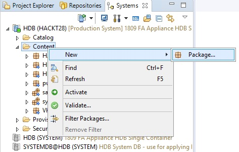
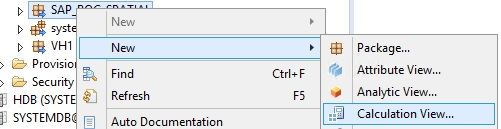
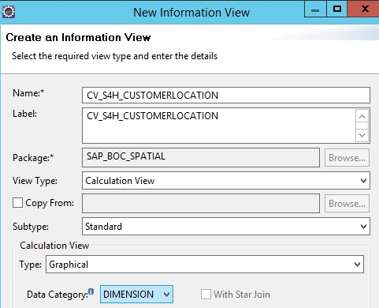
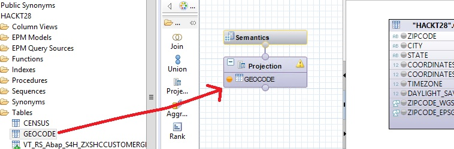
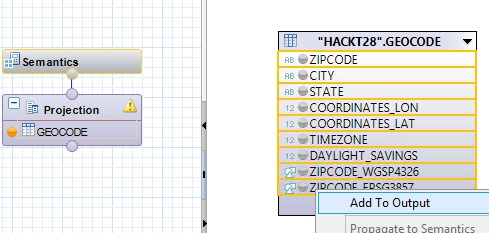
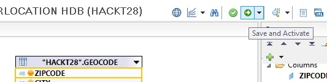
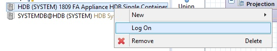
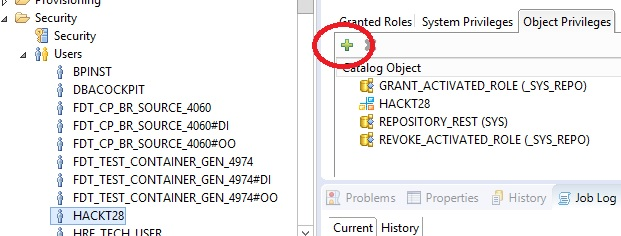
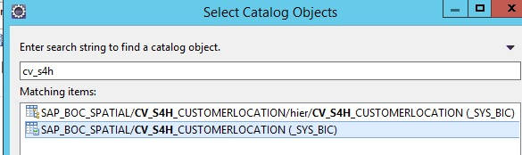
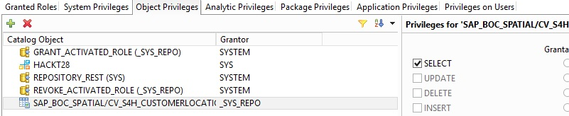

<table width=100% border=>
<tr><td colspan=2><h1>How to Extend S/4HANA with HANA Spatial and SAC</h1></td></tr>
<tr><td><h3>Creation of HANA Calculation Views on Integrated Data</h3></td><td width=60%></br>&nbsp;Task #5, Using Eclipse IDE, HANA Development Perspective</p></td></tr>
</table>

## *****************************************

## NOTE > THIS TASK IS A WORK IN PROGRESS

## *****************************************

## Description

When using a live Connection to HANA from the SAP Analytics Cloud, Calculation Views will be used for the data semantic layer. It is best to create any aggregation and formulae at this database level in order to have the best performance. When a map is required in a Story in SAC, an additional Calculation View will be created to act as a geographical hierarchy / Location Dimension. 


## Prerequisites

You should have completed all of the exercise [Prerequisites](../exercises/preReqs.md). You should have also completed [Task 4: Setup of Sample Spatial Data for the SAP HANA System](hdbData.md) using the Eclipse IDE.

## Steps

In the next steps you will two new Calculation Views. One view will combine the S/4HANA customer sales data with the Census data and will be used to build out a story in the SAP Analytics Cloud. The second view will be used in a location hierarchy for a map. These views will share a common location ID and in the case of this example, the Address ID from the S/4HANA customer data.

1. [Alteration of Geo-Coding Table](#cvAltTab)
1. [Creation of a Location Dimension View](#cvLocDim)

### <a name="cvAltTab"></a> Alteration of Geo-Coding Table

Currently the ZipCode field of the GEOCODE table is a numeric data type. The PostalCode field from the S/4HANA virtual table is a text data type. In order for us to join the two in a Calculation View, a quick alter table statement must be run.

* Open up a new SQL console as your HACKT28 user in the Eclipse SAP HANA Development perspective.
* Paste in the following code and press the Execute button or your F8 key.

```
alter table "HACKT28"."GEOCODE" alter (ZIPCODE NVARCHAR(20)); 
```

### <a name="cvLocDim"></a> Creation of a Location Dimension View

The first Calculation View that you will create will be fairly simple but is a necessary step to have a map in SAC. This view will bring in data via the GEOCODE table that was imported earlier.

* In your HACKT28 connection to your HANA system right click on the Content Folder and choose New > Package.

&nbsp;&nbsp;&nbsp;&nbsp;&nbsp;&nbsp;&nbsp;&nbsp;

* The new package must be named SAP_BOC_SPATIAL as this is the folder that will be searched when creating a Location Dimension later on in SAC.

&nbsp;&nbsp;&nbsp;&nbsp;&nbsp;&nbsp;&nbsp;&nbsp;

* Right click on the new spatial package and choose New (the 2nd New) > Calculation View.

&nbsp;&nbsp;&nbsp;&nbsp;&nbsp;&nbsp;&nbsp;&nbsp;

* Enter "CV_S4H_CUSTOMERLOCATION" as the name and change the "Data Category" to Dimension. Press Finish.

&nbsp;&nbsp;&nbsp;&nbsp;&nbsp;&nbsp;&nbsp;&nbsp;

* In the modeller Scenario panel drag your CENSUS table from your HACKT28 schema into the Projection drop area.

&nbsp;&nbsp;&nbsp;&nbsp;&nbsp;&nbsp;&nbsp;&nbsp;

* Select all of the columns in the table, right click, and then choose "Add to Output".

&nbsp;&nbsp;&nbsp;&nbsp;&nbsp;&nbsp;&nbsp;&nbsp;

* Press the "Save and Activate" button.

&nbsp;&nbsp;&nbsp;&nbsp;&nbsp;&nbsp;&nbsp;&nbsp;

Now that this first location view has been saved to your HANA Repository, you need to assign access rights to your HACKT28 user. This must be done by a user with the appropriate rights and not the HACKT28 user...i.e. users typically can't assign rights to themselves. For this particular step you can use the System user for the HANA database on your S/4HANA trial.

* In the Eclipse System panel, log onto your HDB System using the password that you used when you created the S/4H solution.

&nbsp;&nbsp;&nbsp;&nbsp;&nbsp;&nbsp;&nbsp;&nbsp;

* Open up the Security folder for your HDB System and then Users and then open up the HACKT28 user. Go to the Object Privileges tab and press the plus button.

&nbsp;&nbsp;&nbsp;&nbsp;&nbsp;&nbsp;&nbsp;&nbsp;

* Search on "cv_s4h" for your new Calculation View, select the view's parent object, and then press the OK button.

&nbsp;&nbsp;&nbsp;&nbsp;&nbsp;&nbsp;&nbsp;&nbsp;

* In the privileges panel choose "Select" and then press your F8 key or the "Deploy" button near the top right in Eclipse.

&nbsp;&nbsp;&nbsp;&nbsp;&nbsp;&nbsp;&nbsp;&nbsp;


You have now completed the step "######" and are done with the whole task of "Creation of HANA Calculation Views on Integrated Data".

Your next task is to configure the SAP HANA system so that resources like Calculation Views can be consumed on the SAP Analytics Cloud. 

[Go to Task 6: Setup of the SAP HANA System for Resource Sharing](hdbCORS.md)

[Go Back to the Main Page](../demoHowTo.md)

[Go Back Up to the List of Steps](#steps)
