<table width=100% border=>
<tr><td colspan=2><h1>How to Extend S/4HANA with HANA Spatial and SAC</h1></td></tr>
<tr><td><h3>Creation of HANA Calculation Views on Integrated Data</h3></td><td width=60%></br>&nbsp;Task #5, Using Eclipse IDE, HANA Development Perspective</p></td></tr>
</table>

## Description

When using a live Connection to HANA from the SAP Analytics Cloud, Calculation Views will be used for the data semantic layer. It is best to create any aggregation and formulae at this database level in order to have the best performance. When a map is required in a Story in SAC, an additional Calculation View will be created to act as a geographical hierarchy / Location Dimension. 

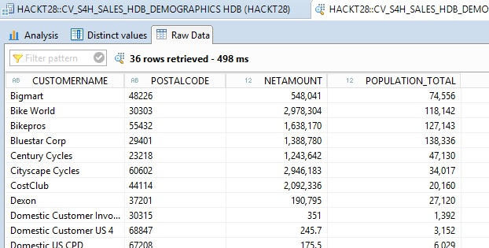

## Prerequisites

You should have completed all of the exercise [Prerequisites](../exercises/preReqs.md). You should have also completed [Task 4: Setup of Sample Spatial Data for the SAP HANA System](hdbData.md) using the Eclipse IDE. If you want more information on the steps to create a map in the SAP Analytics Cloud [please see here.](https://www.sapanalytics.cloud/guided_playlists/creating-geo-map/)

## Steps

In the next steps you will two new Calculation Views. One view will combine the S/4HANA customer sales data with the Census data and will be used to build out a story in the SAP Analytics Cloud. The second view will be used in a location hierarchy for a map. These views will be linked later in the SAP Analytics Cloud using the postal code columns.

1. [Altering the Geo-Coding Table](#cvAltTab)
1. [Creating a Location Dimension View](#cvLocDim)
1. [Assigning Rights to the Location Dimension View](#cvLocDimRights)
1. [Creating the Combined Data View](#cvComDat)

### <a name="cvAltTab"></a> Altering the Geo-Coding Table

Currently the ZipCode field of the GEOCODE table is a numeric data type. The PostalCode field from the S/4HANA virtual table is a text data type. In order for us to join the two in a Calculation View, a quick alter table statement must be run.

* Open up a new SQL console as your HACKT28 user in the Eclipse SAP HANA Development perspective.
* Paste in the following code and press the Execute button or your F8 key.

&nbsp;&nbsp;&nbsp;&nbsp;&nbsp;&nbsp;&nbsp;&nbsp;

```
alter table "HACKT28"."GEOCODE" alter (ZIPCODE NVARCHAR(20)); 
```

### <a name="cvLocDim"></a> Creating a Location Dimension View

The first Calculation View that you will create will be fairly simple but is a necessary step to have a map in SAC. This view will bring in data via the GEOCODE table that was imported earlier. For each postal code (ZipCode) there will be a Spatial Type Column, in particular ST_Point. This point will be used to mark a bubble on the map analytic.

* In your HACKT28 connection to your HANA system right click on the Content Folder and choose New > Package.

&nbsp;&nbsp;&nbsp;&nbsp;&nbsp;&nbsp;&nbsp;&nbsp;

* The new package must be named SAP_BOC_SPATIAL as this is the folder that will be searched when creating a Location Dimension later on in SAC.

&nbsp;&nbsp;&nbsp;&nbsp;&nbsp;&nbsp;&nbsp;&nbsp;

* Right click on the new spatial package and choose New (the 2nd New) > Calculation View.

&nbsp;&nbsp;&nbsp;&nbsp;&nbsp;&nbsp;&nbsp;&nbsp;

* Enter "CV_S4H_CUSTOMERLOCATION" as the name and change the "Data Category" to Dimension. Press Finish.

&nbsp;&nbsp;&nbsp;&nbsp;&nbsp;&nbsp;&nbsp;&nbsp;

* In the modeller Scenario panel drag your CENSUS table from your HACKT28 schema into the Projection drop area.

&nbsp;&nbsp;&nbsp;&nbsp;&nbsp;&nbsp;&nbsp;&nbsp;

* Select all of the columns in the table, right click, and then choose "Add to Output".

&nbsp;&nbsp;&nbsp;&nbsp;&nbsp;&nbsp;&nbsp;&nbsp;

* Press the "Save and Activate" button.

&nbsp;&nbsp;&nbsp;&nbsp;&nbsp;&nbsp;&nbsp;&nbsp;

[Go Back Up to the List of Steps](#steps)

### <a name="cvLocDimRights"></a> Assigning Rights to the Location Dimension View

Now that this first location view has been saved to your HANA Repository, you need to assign access rights to your HACKT28 user. This must be done by a user with the appropriate rights and not the HACKT28 user...i.e. users typically can't assign rights to themselves. For this particular step you can use the System user for the HANA database on your S/4HANA trial.

* In the Eclipse System panel, log onto your HDB System using the password that you used when you created the S/4H solution.

&nbsp;&nbsp;&nbsp;&nbsp;&nbsp;&nbsp;&nbsp;&nbsp;

* Open up the Security folder for your HDB System and then Users and then open up the HACKT28 user. Go to the Object Privileges tab and press the plus button.

&nbsp;&nbsp;&nbsp;&nbsp;&nbsp;&nbsp;&nbsp;&nbsp;

* Search on "cv_s4h" for your new Calculation View, select the view's parent object, and then press the OK button.

&nbsp;&nbsp;&nbsp;&nbsp;&nbsp;&nbsp;&nbsp;&nbsp;

* In the privileges panel choose "Select" and then press your F8 key or the "Deploy" button near the top right in Eclipse.

&nbsp;&nbsp;&nbsp;&nbsp;&nbsp;&nbsp;&nbsp;&nbsp;

[Go Back Up to the List of Steps](#steps)

### <a name="cvComDat"></a> Creating the Combined Data View

The next step is to create another HANA Calculation View that combines the remote data from your S/4HANA system with the data from the Census table you imported before. This particular view will use a spatial join between the two tables where the view will aggregate Census data within a specified distance of an S4H customer location.

* Go to your HACKT28 system connection and open up the Content folder and you should see a HACKT28 package that was created at the time the HACKT28 user was made. Right click on this package and choose New > Calculation View.

&nbsp;&nbsp;&nbsp;&nbsp;&nbsp;&nbsp;&nbsp;&nbsp;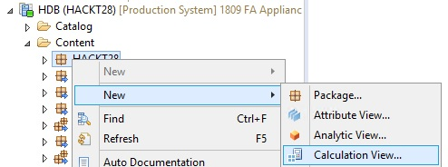

* Assign the view a name of CV_S4H_SALES_HDB_DEMOGRAPHICS and press the Finish button noting that the Data is CUBE. This view will consist of both dimensions and measures as opposed to the Location Dimension view from before.

&nbsp;&nbsp;&nbsp;&nbsp;&nbsp;&nbsp;&nbsp;&nbsp;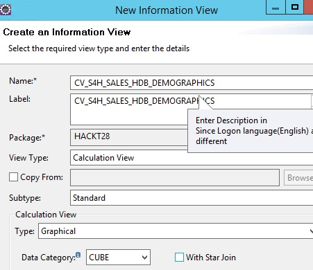

* In the modeler drag a "Join" Node onto the modeler canvas.

&nbsp;&nbsp;&nbsp;&nbsp;&nbsp;&nbsp;&nbsp;&nbsp;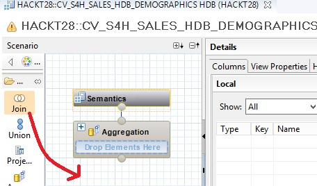

* From your HACKT28 system > Tables drag your "VT_RS_Abap_S4H_ZXSHCSLSORDITFSZ..." table onto the new Join_1 Node.

&nbsp;&nbsp;&nbsp;&nbsp;&nbsp;&nbsp;&nbsp;&nbsp;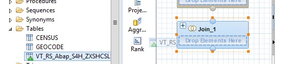

* Also drag the GEOCODE table into the same Join Node.

&nbsp;&nbsp;&nbsp;&nbsp;&nbsp;&nbsp;&nbsp;&nbsp;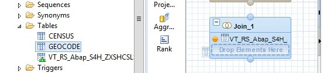

* In the modeler Details pane right click on the visible table and choose "Create Join".

&nbsp;&nbsp;&nbsp;&nbsp;&nbsp;&nbsp;&nbsp;&nbsp;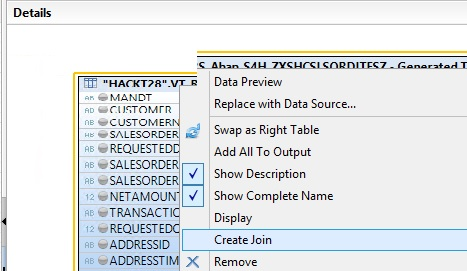

* As the name for the left table is quite lengthy, press the Maximize button for this dialogue so that you can see a menu for the Right Table.

&nbsp;&nbsp;&nbsp;&nbsp;&nbsp;&nbsp;&nbsp;&nbsp;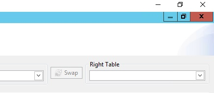

* For the Right Table choose the GEOCODE table.

&nbsp;&nbsp;&nbsp;&nbsp;&nbsp;&nbsp;&nbsp;&nbsp;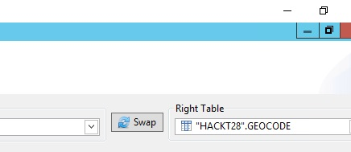

* Drag the Postal Code field from the bottom of the Left table onto the ZipCode field of the Right Table. Change the Join Type to "Inner" and the Cardinality to "1..1" as there be only 1 ZipCode per PostalCode match. Press the OK button to close this dialogue.

&nbsp;&nbsp;&nbsp;&nbsp;&nbsp;&nbsp;&nbsp;&nbsp;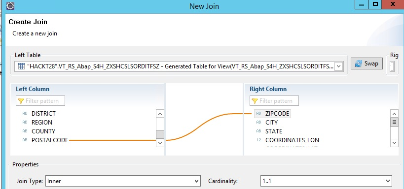

* In the Details pane select the CustomerName, NetAmount, and PostalCode fields. Right click and choose "Add to Output".

&nbsp;&nbsp;&nbsp;&nbsp;&nbsp;&nbsp;&nbsp;&nbsp;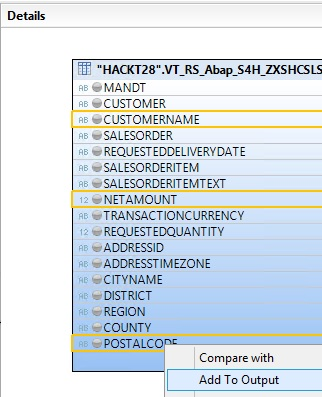

* Scroll the Details pain to the GeoCode table, then right click on the ZipCode_EPSG3857 field and choose "Add to Output".

&nbsp;&nbsp;&nbsp;&nbsp;&nbsp;&nbsp;&nbsp;&nbsp;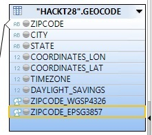

* Drag another Join Node onto your modeler canvas. click on Join_1 and you should see an arrow at the right. Grab that arrow and drag it to the new Join_2.

&nbsp;&nbsp;&nbsp;&nbsp;&nbsp;&nbsp;&nbsp;&nbsp;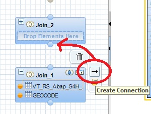

* Click on Join_2 and drag its connection arrow to the Aggregation Node.

&nbsp;&nbsp;&nbsp;&nbsp;&nbsp;&nbsp;&nbsp;&nbsp;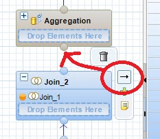

* Drag your CENSUS table onto the Join_2 node.

&nbsp;&nbsp;&nbsp;&nbsp;&nbsp;&nbsp;&nbsp;&nbsp;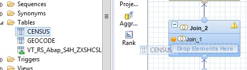

* Now with the focus on the Join_2 Node, right click on the Join_1 object in the Details pane and choose "Create Join".

&nbsp;&nbsp;&nbsp;&nbsp;&nbsp;&nbsp;&nbsp;&nbsp;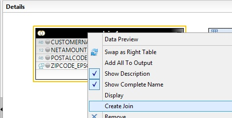

* In the Create Join dialogue change the Right Table to the Census table. 
* Drag the Left Table (Join_1) ZipCode_EPSG3857 field onto the Right Table (Census) Census_Geo_EPSG3857 field.
* Change the Spatial Properties Predicate to "Within Distance".

&nbsp;&nbsp;&nbsp;&nbsp;&nbsp;&nbsp;&nbsp;&nbsp;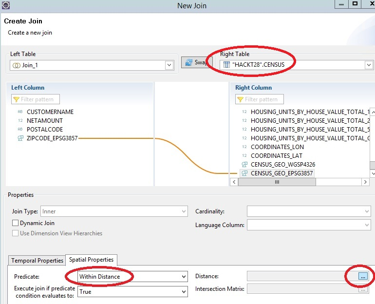

* Click on the Distance button and input 500. This will create a select Census data radius of 500 meters from each S4H customer location. Meters would be the default distance unit for the 3857 Spatial System you created earlier.

&nbsp;&nbsp;&nbsp;&nbsp;&nbsp;&nbsp;&nbsp;&nbsp;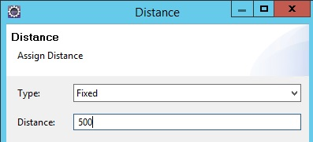

* Press OK to accept the Distance input and press OK to close the Create Join dialogue.
* With Join_2 still selected in the canvas, right click on the Join_1 output table, select the CustomerName, NetAmount and PostalCode fields. Right click and choose "Add To Output".

&nbsp;&nbsp;&nbsp;&nbsp;&nbsp;&nbsp;&nbsp;&nbsp;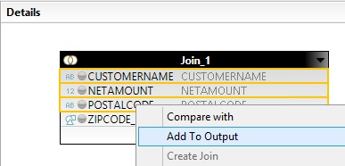

* Scroll to the Census output table and note that there a lot of different measures that you could use for this Calculation View. For the sake of simplicity in this workflow right click on Population_Total and choose "Add To Output".

&nbsp;&nbsp;&nbsp;&nbsp;&nbsp;&nbsp;&nbsp;&nbsp;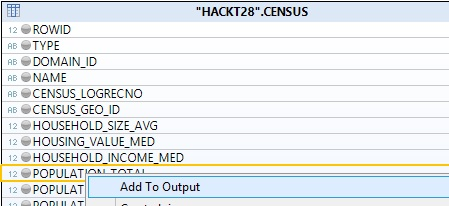

* Select the Aggregation Node and then select CustomerName and PostalCode, right click and choose "Add To Output".

&nbsp;&nbsp;&nbsp;&nbsp;&nbsp;&nbsp;&nbsp;&nbsp;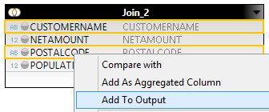

* Now select NetAmount and Population_Total, right click, but this time choose "Add As Aggregated Column".

&nbsp;&nbsp;&nbsp;&nbsp;&nbsp;&nbsp;&nbsp;&nbsp;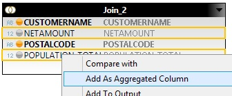

* Click on the Semantics Node and you should see results like below with two columns marked with an Aggregation type of Sum.

&nbsp;&nbsp;&nbsp;&nbsp;&nbsp;&nbsp;&nbsp;&nbsp;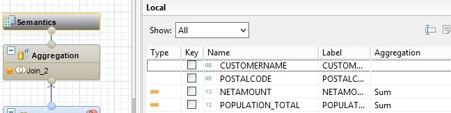

* Press the "Save and Activate" button to save this Calculation View to the HANA Repository.

&nbsp;&nbsp;&nbsp;&nbsp;&nbsp;&nbsp;&nbsp;&nbsp;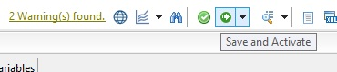

* Press the "Data Preview" button.

&nbsp;&nbsp;&nbsp;&nbsp;&nbsp;&nbsp;&nbsp;&nbsp;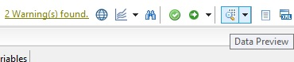

* Now click on the Raw Data tab and you will see the combined S/4HANA sales data with the HDB Census data. Based on the workflow, the Population_Total is a Spatial Type aggregation using a 500 meter radius that you entered in the Create Join dialogue.

&nbsp;&nbsp;&nbsp;&nbsp;&nbsp;&nbsp;&nbsp;&nbsp;

You have now completed the step "Creating the Combined Data View" and are done with the whole task of "Creation of HANA Calculation Views on Integrated Data".

Your next task is to configure the SAP HANA system so that resources like Calculation Views can be consumed on the SAP Analytics Cloud. 

[Go to Task 6: Setup of the SAP HANA System for Resource Sharing](hdbCORS.md)

[Go Back to the Main Page](../demoHowTo.md)

[Go Back Up to the List of Steps](#steps)
