<table width=100% border=>
<tr><td colspan=2><h1>How to Extend S/4HANA with HANA Spatial and SAC</h1></td></tr>
<tr><td><h3>Creating Custom ABAP CDS Views in S/4HANA</h3></td><td width=60%></br>&nbsp;Task #1, Using Eclipse IDE, ABAP Perspective</p></td></tr>
</table>

 
## Description

In these steps you will create two ABAP CDS views in our S/4HANA system. These custom 'z' views will combine data from several existing CDS views and will be accessed later on from your HANA database. 

One view will add address location data and product data into an existing customer sales view and the other view will have just customer location data from a customer information model. The latter view will be used later in a Calculation View that provides a location hierarchy for the SAP Analytics Cloud.

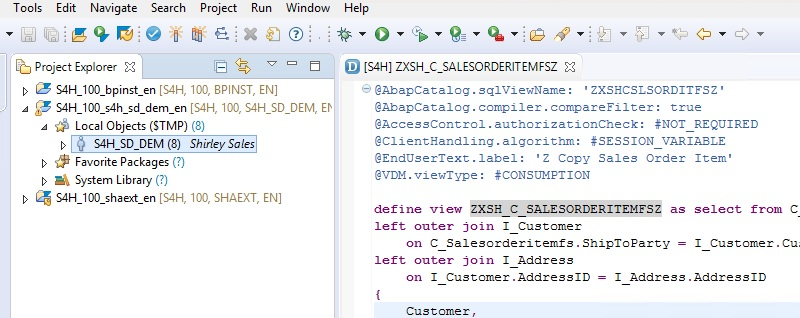


## Prerequisites

You should now have an S/4HANA fully activated trial appliance activated and running. This appliance will have a Windows client, accessible by Remote Desktop, with the Eclipse IDE with SAP HANA tools installed. If you have not yet done so, please see [the Prerequisites page](exercises/preReqs.md) for more information.

You might want to have some familiarity with ABAP CDS views in S/4HANA but that is not a big requirement. When working with S/4HANA you don't necessarily have to create your own CDS views from the ground up as you might just wish to slightly modify / extend one of the many existing CDS views.

If you want to find out more about creating your own virtual models in CDS please see [the HANA Academy playlist on ABAP CDS here](https://www.youtube.com/playlist?list=PLkzo92owKnVxO-jWmOWugBv_9WQiq8wLc). Please note that these videos were created using an earlier S/4HANA trial system (on version 1510) so some workflows might be slightly different looking, but the concepts should be the same.


## <a name="steps"></a> Steps

There are two views that you need to create and they are based on existing S/4HANA CDS views. ABAP CDS is a combination of simple SQL and CDS annotations. In this case the new views will just combine other existing views using joins. Before you create those views, you need to create a project in our ABAP repository.

1. [Making an ABAP Project as a User With Access to Customer Sales](#abapproj)

2. [Creation of CDS View with Customer Sales, Products, and Location in S/4HANA](#cdsview1)

3. [Creation of CDS View with Customer Location Data in S/4HANA](#cdsview2)


### <a name="abapproj"></a> Making an ABAP Project as a User With Access to Customer Sales

In order to create the CDS views we need to add a user based ABAP project to the Project Explorer. 

* Open up your Eclipse IDE; it may be named SAP Dev Tools for Eclipse on the S/4HANA trial Windows client. 

* If the ABAP Perspective is not opened by default then check for a toolbar shortcut to open the ABAP perspective.

&nbsp;&nbsp;&nbsp;&nbsp;&nbsp;&nbsp;&nbsp;&nbsp;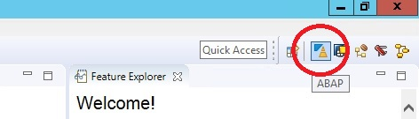


* If you don't see an ABAP shortcut then click on the Open Perspective shortcut to get the full list. (Perspectives are also accessible through the Window menu > Perspective > Open Perspective > Other.)

&nbsp;&nbsp;&nbsp;&nbsp;&nbsp;&nbsp;&nbsp;&nbsp;


* If you are using the trial appliance you should see an existing project for the BPINST user. Right click on that project and choose Duplicate. 

&nbsp;&nbsp;&nbsp;&nbsp;&nbsp;&nbsp;&nbsp;&nbsp;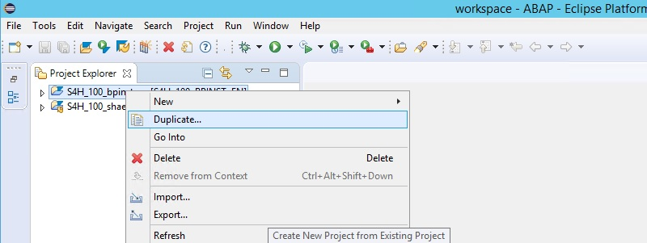


* You will see the connection info for your S/4HANA system. 

&nbsp;&nbsp;&nbsp;&nbsp;&nbsp;&nbsp;&nbsp;&nbsp;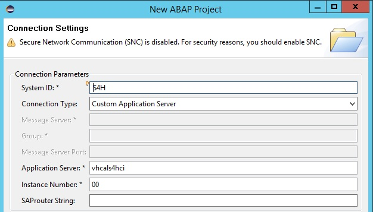


* Click on Next and you will see a dialogue to enter in user info.

&nbsp;&nbsp;&nbsp;&nbsp;&nbsp;&nbsp;&nbsp;&nbsp;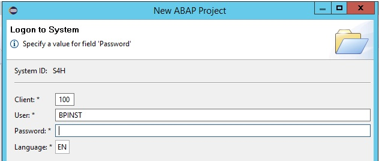


* If you are using the trial appliance then you will have existing demo users available for different scenarios. On your Windows client desktop you should see a shortcut for a Welcome page. If you don't see this shortcut, copy the following link into a new browser tab on your Windows client.

```

file:///C:/ProgramData/WelcomePage/Welcome.html

```

* You should see a list of users similar to below. We want to use the S4H_SD_DEM demo user.

&nbsp;&nbsp;&nbsp;&nbsp;&nbsp;&nbsp;&nbsp;&nbsp;


* Enter the demo user info and then press Finish. You are now ready to create ABAP CDS views in your S/4HANA system.

&nbsp;&nbsp;&nbsp;&nbsp;&nbsp;&nbsp;&nbsp;&nbsp;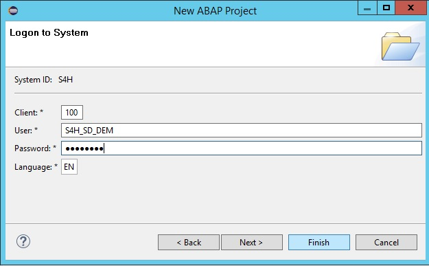


* If you are not using the S/4HANA trial system, then you will need to have a user that has the following roles. Note that the Business Roles for the S/4HANA technical user (S4H_SD_DEM) include:

&nbsp;&nbsp;&nbsp;&nbsp;&nbsp;&nbsp;&nbsp;&nbsp;SAP_BR_SALES_MANAGER

* For the full list of Roles (some of these will be Z roles specific to the trial appliance) [please click here.](../other/s4hSalesDemoUserRoles.csv)

You have now completed the step "Making an ABAP Project as a User With Access to Customer Sales".


[Go Back Up to the List of Steps](#steps)


### <a name="cdsview1"></a> Creation of CDS View with Customer Sales, Products, and Location

The first CDS view that needs to be created will include sales amounts by customer > location > product. 


* Open your new Eclipse ABAP project for the S4H_SD_DEM user and navigate to Local Objects > S4H_SD_DEM.

&nbsp;&nbsp;&nbsp;&nbsp;&nbsp;&nbsp;&nbsp;&nbsp;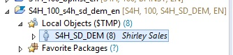


* Right click on the S4H_SD_DEM folder and choose New > Other ABAP Repository Object.

&nbsp;&nbsp;&nbsp;&nbsp;&nbsp;&nbsp;&nbsp;&nbsp;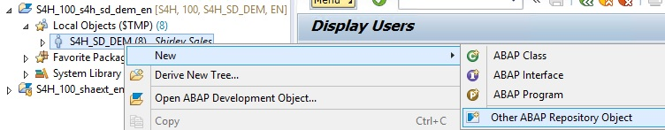


* In the Core Data Services folder select Data Definition and then press Next.

&nbsp;&nbsp;&nbsp;&nbsp;&nbsp;&nbsp;&nbsp;&nbsp;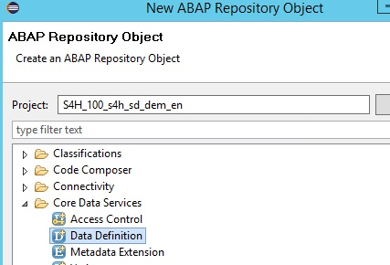


* In the Data Definition dialogue, enter the following information. Afterwards press Finish.

```
Name = ZXSH_C_SALESORDERITEMFSZ
Description = Public Consumption View, Z Copy Sales Order Item
```

&nbsp;&nbsp;&nbsp;&nbsp;&nbsp;&nbsp;&nbsp;&nbsp;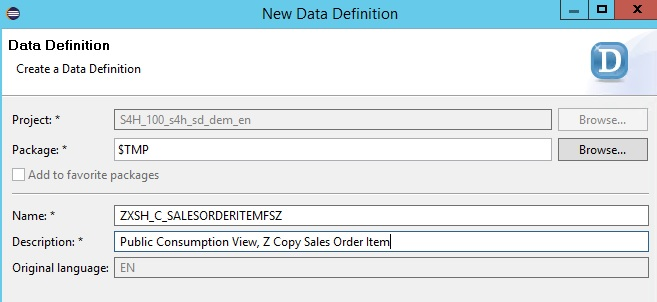


* Replace the default code in the view editor with the following code.
	
```
@AbapCatalog.sqlViewName: 'ZXSHCSLSORDITFSZ'
@AbapCatalog.compiler.compareFilter: true
@AccessControl.authorizationCheck: #NOT_REQUIRED
@ClientHandling.algorithm: #SESSION_VARIABLE
@EndUserText.label: 'Z Copy Sales Order Item'
@VDM.viewType: #CONSUMPTION

define view ZXSH_C_SALESORDERITEMFSZ as select from C_Salesorderitemfs
left outer join I_Customer
    on C_Salesorderitemfs.ShipToParty = I_Customer.Customer
left outer join I_Address
    on I_Customer.AddressID = I_Address.AddressID
{
    Customer,
    CustomerName,
    SalesOrder,
    RequestedDeliveryDate,
    SalesOrderItem,
    SalesOrderItemText,
    NetAmount,
    TransactionCurrency,
    RequestedQuantity,
    I_Address.AddressID,
    I_Address.AddressTimeZone,
    I_Address.CityName,
    I_Address.District,
    I_Address.Region,
    I_Address.County,
    left(I_Address.PostalCode,5) as PostalCode
}
```

* Now press the Activate button.

&nbsp;&nbsp;&nbsp;&nbsp;&nbsp;&nbsp;&nbsp;&nbsp;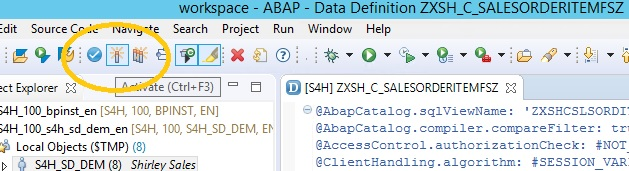


* Your new CDS view should now be ready to use. Highlight the CDS view name.

&nbsp;&nbsp;&nbsp;&nbsp;&nbsp;&nbsp;&nbsp;&nbsp;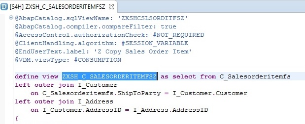


* Right click on the CDS view name and choose Open With > Data Preview.

&nbsp;&nbsp;&nbsp;&nbsp;&nbsp;&nbsp;&nbsp;&nbsp;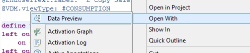


* Now you should see a record set returned similar to the following.

&nbsp;&nbsp;&nbsp;&nbsp;&nbsp;&nbsp;&nbsp;&nbsp;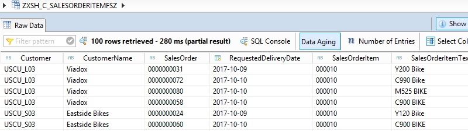

You have now completed the setp "Creation of CDS View with Customer Sales, Products, and Location".

[Go Back Up to the List of Steps](#steps)


### <a name="cdsview2"></a> Creation of CDS View with Customer Location

The second CDS view that needs to be created will be a customer location hierarchy. This hierarchical data will be used later on in the SAP Analytics Cloud for the mapping component. 

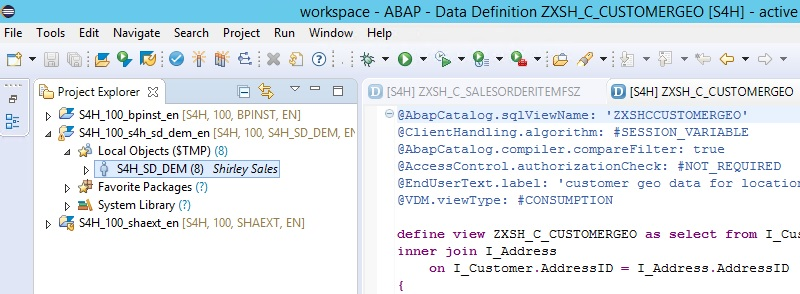


* Use the same method as above to create a new CDS view Data Definition. In the dialogue enter the following information and press Finish.

```
Name = ZXSH_C_CUSTOMERGEO
Description = Public Consumption View, Customer Location Hierarchy
```

* Replace the default code in the view editor with the following code. Note that in this case aliases are being used for the view output. This is very important as this view will be later used in the SAP Analytics Cloud for a Location Dimension. The field names in the Location Dimension must be different than the field names in the other view to avoid errors. Of course you can always rename those fields later on when you are using the HANA Modeling tool.

```
@AbapCatalog.sqlViewName: 'ZXSHCCUSTOMERGEO'
@ClientHandling.algorithm: #SESSION_VARIABLE
@AbapCatalog.compiler.compareFilter: true
@AccessControl.authorizationCheck: #NOT_REQUIRED
@EndUserText.label: 'customer geo data for location hierarchy'
@VDM.viewType: #CONSUMPTION

define view ZXSH_C_CUSTOMERGEO as select from I_Customer 
inner join I_Address
    on I_Customer.AddressID = I_Address.AddressID
{
   I_Customer.Customer as LHCustomer,
   I_Address.AddressID as LHAddressID, 
   I_Address.AddressTimeZone as LHAddressTimeZone, 
   I_Address.CityName as LHCityName,
   I_Address.District as LHDistrict,
   I_Address.Region as LHRegion,
   I_Address.County as LHCounty,
   I_Address.Country as LHCountry,
   left(I_Address.PostalCode,5) as LHPostalCode
}
```

* Press the Activate button.

You have now completed the step "Creation of CDS View with Customer Location" and are done with the whole task of "Creating Custom ABAP CDS Views in S/4HANA".

Your next task is to create a development / technical user in your HANA database. With this user you will create a new HANA schema, Remote Sources to the S/4HANA system, Calculation Views, etc.

[Go to Task 2: Creation of Developer User for the SAP HANA System](hdbUser.md)

[Go Back to the Main Page](../demoHowTo.md)

[Go Back Up to the List of Steps](#steps)
