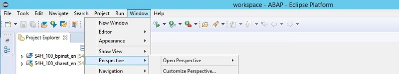
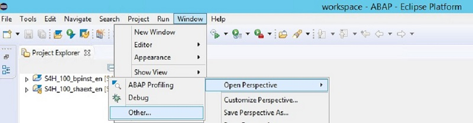

<table width=100% border=>
<tr><td colspan=2><h1>How to Extend S/4HANA with HANA Spatial and SAC</h1></td></tr>
<tr><td><h3>Creating Custom ABAP CDS Views in S/4HANA</h3></td><td width=60%></br>&nbsp;Task #1, Using Eclipse IDE</p></td></tr>
</table>

## Description

In these steps we will create two ABAP CDS views in our S/4HANA system. These custom 'z' views will combine data from several existing CDS views and will be accessed later on from our HANA database. 

One view will add address location data and product data into an existing customer sales view and the other view will have just customer location data from a customer information model. The latter view will be used later in a Calculation View that provides a location hierarchy for the SAP Analytics Cloud.


## Prerequisites

You should now have an S/4HANA fully activated trial appliance activated and running. This appliance will have a Windows client, accessible by Remote Desktop, with the Eclipse IDE with SAP HANA tools installed. If you have not yet done so, please see [the Prerequisites page](exercises/preReqs.md) for more information.

You might want to have some familiarity with ABAP CDS views in S/4HANA but that is not a big requirement. When working with S/4HANA you don't necessarily have to create your own CDS views from the ground up as you might just wish to slightly modify / extend one of the many existing CDS views.

If you want to find out more about creating your own virtual models in CDS please see [the HANA Academy playlist on ABAP CDS here](https://www.youtube.com/playlist?list=PLkzo92owKnVxO-jWmOWugBv_9WQiq8wLc). Please note that these videos were created using an earlier S/4HANA trial system (on version 1510) so some workflows might be slightly different looking, but the concepts should be the same.


## <a name="steps"></a> Steps

There are two views that we need to create and they are based on existing S/4HANA CDS views. Open up your Eclipse IDE; it may be named SAP Dev Tools for Eclipse on the S/4HANA trial Windows client. 

If the ABAP Perspective is not open then go to the Window menu and choose Perspective > and then Open Perspective.



Now choose Other.



And then select ABAP.


```

file:///C:/ProgramData/WelcomePage/Welcome.html

```

The first CDS view that needs to be created will include sales amounts by customer > location > product. 

2. [Creation of CDS View with Customer Sales, Products, and Location in S/4HANA](#cdsview1)

The second CDS view that needs to be created will be a customer location hierarchy. This hierarchical data will be used later on in the SAP Analytics Cloud for the mapping component. 

2. [Creation of CDS View with Customer Location Data in S/4HANA](#cdsview2)


### <a name="cdsview1"></a> Creation of CDS View with Customer Sales, Products, and Location

The first CDS view that needs to be created will include sales amounts by customer > location > product. In your Eclipse ABAP project create a new CDS view with the following information.

```
Name = ZXSH_C_SALESORDERITEMFSZ
Description = Public Consumption View, Z Copy Sales Order Item
```


Copy the following code into the view editor. You can substitute the "SH" in ZXSH to match your namespace.
	
```
@AbapCatalog.sqlViewName: 'ZXSHCSLSORDITFSZ'
@AbapCatalog.compiler.compareFilter: true
@AccessControl.authorizationCheck: #NOT_REQUIRED
@ClientHandling.algorithm: #SESSION_VARIABLE
@EndUserText.label: 'Z Copy Sales Order Item'
@VDM.viewType: #CONSUMPTION

define view ZXSH_C_SALESORDERITEMFSZ as select from C_Salesorderitemfs
left outer join I_Customer
    on C_Salesorderitemfs.ShipToParty = I_Customer.Customer
left outer join I_Address
    on I_Customer.AddressID = I_Address.AddressID
{
    Customer,
    CustomerName,
    SalesOrder,
    RequestedDeliveryDate,
    SalesOrderItem,
    SalesOrderItemText,
    NetAmount,
    TransactionCurrency,
    RequestedQuantity,
    I_Address.AddressID,
    I_Address.AddressTimeZone,
    I_Address.CityName,
    I_Address.District,
    I_Address.Region,
    I_Address.County,
    I_Address.PostalCode
}
```

[Back to Steps](#steps)


### <a name="cdsview2"></a> Creation of CDS View with Customer Location

The second CDS view that needs to be created will be a customer location hierarchy. This hierarchical data will be used later on in the SAP Analytics Cloud for the mapping component. In your Eclipse ABAP project create a new CDS view with the following information.

```
Name = ZXSH_C_CUSTOMERGEO
Description = Public Consumption View, Customer Location Hierarchy
```


Copy the following code into the view editor. You can substitute the "SH" in ZXSH to match your namespace.

```
@AbapCatalog.sqlViewName: 'ZXSHCCUSTOMERGEO'
@ClientHandling.algorithm: #SESSION_VARIABLE
@AbapCatalog.compiler.compareFilter: true
@AccessControl.authorizationCheck: #NOT_REQUIRED
@EndUserText.label: 'customer geo data for location hierarchy'
@VDM.viewType: #CONSUMPTION

define view ZXSH_C_CUSTOMERGEO as select from I_Customer 
inner join I_Address
    on I_Customer.AddressID = I_Address.AddressID
{
   I_Customer.Customer as LHCustomer,
   I_Address.AddressID as LHAddressID, 
   I_Address.AddressTimeZone as LHAddressTimeZone, 
   I_Address.CityName as LHCityName,
   I_Address.District as LHDistrict,
   I_Address.Region as LHRegion,
   I_Address.County as LHCounty,
   I_Address.Country as LHCountry,
   I_Address.PostalCode as LHPostalCode
}
```
