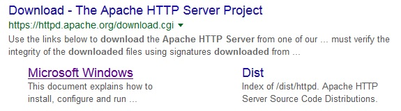
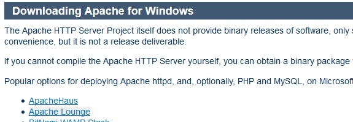
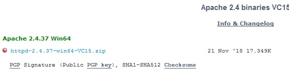
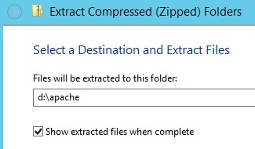
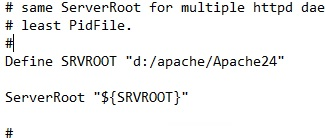
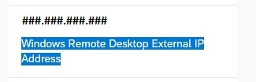

<table width=100% border=>
<tr><td colspan=2><h1>How to Extend S/4HANA with HANA Spatial and SAC</h1></td></tr>
<tr><td><h3>Creation of Connection and Models and Story in SAP Analytics Cloud</h3></td><td width=60%></br>&nbsp;Task #6, Apache HTTP Server & SAP Analytics Cloud</p></td></tr>
</table>

## Description

In the next steps you will set up a connection between your SAP HANA database and the SAP Analytics Cloud. Afterwards you will work in SAC to create analytics based on live data from that connection.


## Prerequisites

You should have completed all of the exercise [Prerequisites](../exercises/preReqs.md). You should have also completed [Task 5: Creation of HANA Calculation Views on Integrated Data](hdbViews.md) using the Eclipse IDE.

## <a name="steps"></a> Steps

A connection must be made between your SAP HANA database and the SAP Analytics Cloud. In order to establish the sharing of objects from HANA with SAC, you must do so with either [CORS (Cross-Origin Resource Sharing) or via a reverse proxy.](https://blogs.sap.com/2017/12/29/creating-sap-analytics-cloud-live-connection-to-sap-hana-database-on-sap-cloud-platform/) In this exercise you will set up CORS and then later a "Direct" connection will be used in SAC.

Once the connection between SAC & HANA is established a Model, including a Location Dimension, will be created in SAC as well as a Story which will feature a map.

1. [Connecting WinSCP to the S/4HANA Appliance's Linux File System](#winscp)

1. [######](#   )

### <a name="winscp"></a> Connecting WinSCP to the S/4HANA Appliance's Linux File System

The first step will involve configuring the WinSCP that was downloaded and installed in the Prerequisite section.

* Open up WinSCP and enter the following information into the main dialogue.

``
1 Host Name: vhcalhdbdb.dummy.nodomain
2 User Name: root
``

&nbsp;&nbsp;&nbsp;&nbsp;&nbsp;&nbsp;&nbsp;&nbsp;

* Press the "Advanced" button.

&nbsp;&nbsp;&nbsp;&nbsp;&nbsp;&nbsp;&nbsp;&nbsp;

* Click on "Authentication".
* Press the browse button for the Private Key file.

&nbsp;&nbsp;&nbsp;&nbsp;&nbsp;&nbsp;&nbsp;&nbsp;

* In the file type select "All Private Key Files".
* Browse to where you stored your pem file in the Prerequisites, select it, and press Open.

&nbsp;&nbsp;&nbsp;&nbsp;&nbsp;&nbsp;&nbsp;&nbsp;

* Press OK to convert the Open SSH Private Key to a Putty (ppk) format.

&nbsp;&nbsp;&nbsp;&nbsp;&nbsp;&nbsp;&nbsp;&nbsp; 

* For the Password enter the main password that you used when you created your appliance in CAL.SAP.com and press OK.

&nbsp;&nbsp;&nbsp;&nbsp;&nbsp;&nbsp;&nbsp;&nbsp;

* Press the Save button to save the ppk file to the same directory as your original pem file.
* You should get a successful message. Press the OK button to close this message and then press the OK button to close the Advanced Site settings dialogue.

&nbsp;&nbsp;&nbsp;&nbsp;&nbsp;&nbsp;&nbsp;&nbsp;

* In the main WinSCP dialogue press the Save button and then the OK button to accept the default name.
* Press the "Login" button and you should see a warning about connecting to an unknown server. Press Yes to ignore the error.
* Enter the password you used earlier and then press OK. You should now be connected to the file system of the Linux machine hosting your S/4HANA system.

&nbsp;&nbsp;&nbsp;&nbsp;&nbsp;&nbsp;&nbsp;&nbsp;


* xxxxxxxxxxxxxxxxxx
*
* OLD Section
*
* xxxxxxxxxxxxxxxxxx

If you are looking for info on how to set up the connection for a production environmnet then please consult [help.sap.com with a search on "SAP Analytics Cloud Live Data Connections to SAP HANA".](https://help.sap.com/viewer/search?q=SAP%20Analytics%20Cloud%20Live%20Data%20Connections%20to%20SAP%20HANA)

* On the Windows client of your S/4HANA system do a browser search for "apache http server download" and in the "Download - The Apache HTTP Server Project" result click on the Microsoft Windows link.

&nbsp;&nbsp;&nbsp;&nbsp;&nbsp;&nbsp;&nbsp;&nbsp;

* Choose the "Apache Lounge" as the distributor option for the binary installer. 

&nbsp;&nbsp;&nbsp;&nbsp;&nbsp;&nbsp;&nbsp;&nbsp;

* Choose the latest Win64 option to download.

&nbsp;&nbsp;&nbsp;&nbsp;&nbsp;&nbsp;&nbsp;&nbsp;

* Go to your downloads folder and extract the "httpd-2..." archive to a folder of "d:\apache" with the "Show extracted files..." option.

&nbsp;&nbsp;&nbsp;&nbsp;&nbsp;&nbsp;&nbsp;&nbsp;

* In the "D:\apache\Apache24\conf" directory choose to open the "http.conf" file with Notepad.
* Find the ServerRoot variable and change it so that it uses your install path, e.g. d:/apache/Apache24".

&nbsp;&nbsp;&nbsp;&nbsp;&nbsp;&nbsp;&nbsp;&nbsp;

* You will need the external IP address of the Windows client machine that you are using for your Remote Desktop.
* Go back to the http.conf file. Find the ServerName variable, and uncomment the line if necessary. Change the value to the external IP address you got from CAL.SAP.com.

&nbsp;&nbsp;&nbsp;&nbsp;&nbsp;&nbsp;&nbsp;&nbsp;

######

* port 443 (& optional 44301) must be opened in firewall

To open a port in the Windows firewall for TCP access
On the Start menu, click Run, type WF.msc, and then click OK.
In the Windows Firewall with Advanced Security, in the left pane, right-click Inbound Rules, and then click New Rulein the action pane (upper right corner).


* ina config...if necessary???

http://vhcalhdbdb.dummy.nodomain:8002/sap/hana/xs/admin/#/package/sap.bc.ina.service

* use sql console instead of above
```
UPDATE "_SYS_XS"."RUNTIME_CONFIGURATION" 
SET "CONFIGURATION" = ' {"cors":{
	"enabled":true,
	"allowOrigin":["https://sha.us2.sapanalytics.cloud"],
	"exposeHeaders":["x-csrf-token"],
	"allowHeaders":["accept-language",
	"x-sap-cid","x-request-with",
	"x-csrf-token","content-type",
	"authorization","accept"],
	"allowMethods":["GET","HEAD","POST","OPTIONS"],
	"maxAge":3600}}' 
WHERE "PACKAGE_ID" = 'sap.bc.ina.service.v2';
```

* moving certificates
https://www.digicert.com/move-certificate-to-another-certificate-store.htm


######

```
code block
```

You have now completed the step "Setup of Reverse Proxy Server on the Windows Client".

[Go Back Up to the List of Steps](#steps)

You have now completed the step "######" and are done with the whole task of "Creation of Connection and Models and Story in SAP Analytics Cloud". You have also completed the entire exercise...congratulations!

[Go Back to the Main Page](../demoHowTo.md)

[Go Back Up to the List of Steps](#steps)
