<table width=100% border=>
<tr><td colspan=2><h1>How to Extend S/4HANA with HANA Spatial and SAC</h1></td></tr>
<tr><td><h3>Creation of Direct Connection to HANA, and Analytics in SAP Analytics Cloud</h3></td><td width=60%></br>&nbsp;Task #7, SAP Analytics Cloud</p></td></tr>
</table>

## Description

In the next steps you will set up a connection from the SAP Analytics Cloud (SAC) to your SAP HANA database. Afterwards you will work in SAC to create a map analytic based on live data from that connection.

&nbsp;&nbsp;&nbsp;&nbsp;&nbsp;&nbsp;&nbsp;&nbsp;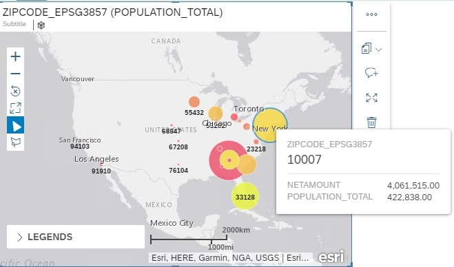

Note that in this workshop you will not spend much time on modeling and building analytics in SAC. There is a lot of information on this already. If you want a lot of in depth information on these topics, please see the online help for [SAP Analytics Cloud starting with data models.](https://www.sapanalytics.cloud/guided_playlists/data-models/)

## Prerequisites

You should have completed all of the exercise [Prerequisites](../exercises/preReqs.md). You should have also completed [Task 6: Setup of the SAP HANA System for Resource Sharing](hdbCORS.md) using WinSCP and the Eclipse IDE.

## <a name="steps"></a> Steps

Now that the HANA resources (Calculation Views etc.) have been made available by setting up Cross Origin Resource Sharing (CORS) you can make a Connection in SAC to the HANA database on your trial system. This will be a "Direct" connection using the HACKT28 technical user and will be on live data. 

Afterwards you will create a model based on the combined S/4HANA and census data. A Location Dimension will also be added to the model so that a map can be added to your analytic story. 

1. [Creating a Live Direct Data Connection to SAP HANA](#saccon)
1. [Troubleshooting a Connection Error from SAC to HANA](#sacconts)
1. [Creating a SAC Data Model with a Location Dimension](#sacmod)
1. [Creating a SAC Story with a Map](#sacmap)

### <a name="saccon"></a> Creating a Live Direct Data Connection to SAP HANA

In this exercise, you will create a Direct Connection between your HANA database and SAC. This is possible as in the last task you enabled Cross Origin Resource Sharing (CORS) in your HANA system.

* Log into your SAP Analytics Cloud (SAC) tenant (using Chrome as currently it's the only fully supported browser for SAC) and press the "Main Menu" button and choose the "Connection" option.

&nbsp;&nbsp;&nbsp;&nbsp;&nbsp;&nbsp;&nbsp;&nbsp;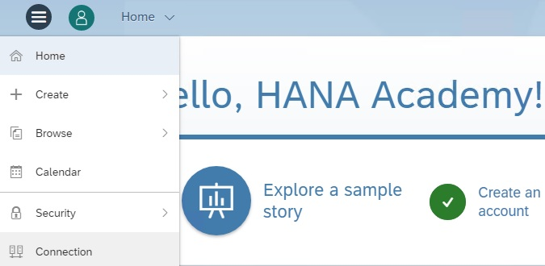

* Add a new Connection choosing Live Data Connection > SAP HANA.

&nbsp;&nbsp;&nbsp;&nbsp;&nbsp;&nbsp;&nbsp;&nbsp;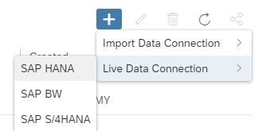

* In the New Live Connection dialogue use the following info.

```
Connection Type: Direct
Host: vhcalhdbdb.dummy.nodomain
HTTPS Port: 4302
Authentication Method: User Name and Password
User Name: hackt28
Password: the one that you gave to your HACKT28 user
```

&nbsp;&nbsp;&nbsp;&nbsp;&nbsp;&nbsp;&nbsp;&nbsp;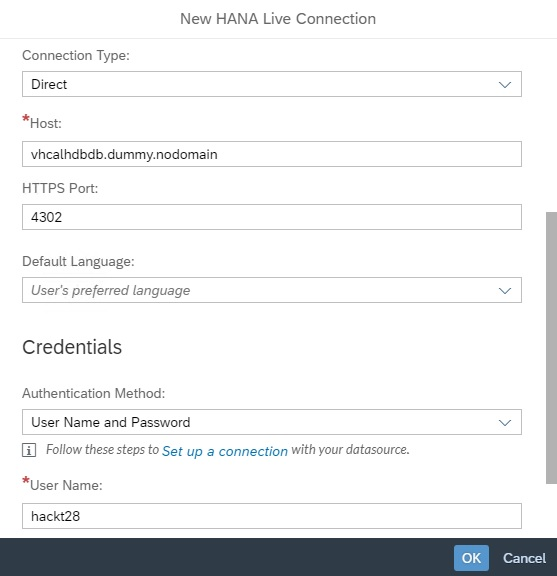

* Press the OK button. Hopefully all is ok with your connection and you will see a new SAC Connection in your list.

&nbsp;&nbsp;&nbsp;&nbsp;&nbsp;&nbsp;&nbsp;&nbsp;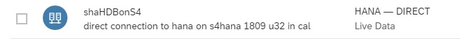

If you do not see an error and do have a new successful connection, then please skip the next step and go to [Creating a SAC Data Model with a Location Dimension.](#sacmod)  

If you do get an error message it most likely asking you to check your CORS settings or an error mentioning SSL and your credentials. In this case you will want to follow the troubleshooting steps below.

&nbsp;&nbsp;&nbsp;&nbsp;&nbsp;&nbsp;&nbsp;&nbsp;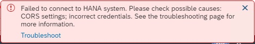

### <a name="sacconts"></a> Troubleshooting a Connection Error from SAC to HANA

This step is only necessary if you get an error when trying to connect to your HANA system from SAC. Please note that after testing, the later releases of the S/4HANA trial (e.g. >= 1809 U32) seem to have less connection issues than previous versions such as the 1709 versions. Later versions of Chrome seem to work better as well.

* In the error that you got, there is a link to open up a "Troubleshoot" page.

* The help page mentions a certificate issue. If you are using an S/4HANA trial then it will have self-signed certificates and you've probably already seen some warnings whilst using some of the SAP HANA tools in Chrome.

* One additional point (at the time that this exercise was written, January 4, 2019 at 1:56 PM, PST) is that you don't get an option to ignore the certificate warnings in the SAC connection like you do in the HANA web based tools you've been using.

* Here are some things that you can do to try to resolve the issue:
  - Update your Chrome browser by going to the "Customize and Control Chrome" menu (the 3 vertical dots in the top right) and choose Help > About Google Chrome. Try creating the Connection in SAC again.
  - Press the Windows button in the lower left of your Windows Desktop client and type in "Internet Options". Go to the Security tab > Trusted Sites > Sites and make sure your host name is added: "https://vhcalhdbdb.dummy.nodomain". Try creating the Connection in SAC again.
  - Close Chrome and then go to the Windows button and type Run and then enter "chrome -–ignore-certificate-errors". Try creating the Connection in SAC again.
  - As a last resort (and, please, this is only for those using a trial appliance) use a brute force method and reboot your entire S/4HANA trial system in CAL. Try creating the Connection in SAC again. This has worked as a last resort on 1709 & 1809 S/4HANA trial systems.

[Go Back Up to the List of Steps](#steps)

### <a name="sacmod"></a> Creating a SAC Data Model with a Location Dimension

In this step we will create a Model using the Calculation View that has the combined data in your HANA system. You will also add a Location Dimension off of the second view you created on the geo-coded data. You should now have a Live, Direct connection to your HANA system to make this possible.

* Press the Main Menu / hamburger button and choose Create and then Model.

&nbsp;&nbsp;&nbsp;&nbsp;&nbsp;&nbsp;&nbsp;&nbsp;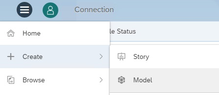

* Choose "Get data from a datasource".
* Click on "Live Data connection" (right below Connect to live data).
* Fill out the appropriate info in the Create Model dialogue.

```
System Type:  SAP HANA
Connection:   the name of the Connection you built in step 1 above
Data Source:  search on "CV_S4H" or the name of the combined data model you built in Task 5

Name & Description: whatever you like
```
&nbsp;&nbsp;&nbsp;&nbsp;&nbsp;&nbsp;&nbsp;&nbsp;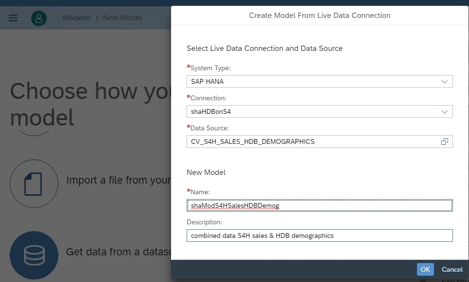

* After pressing OK you should see a screen similar to below.

&nbsp;&nbsp;&nbsp;&nbsp;&nbsp;&nbsp;&nbsp;&nbsp;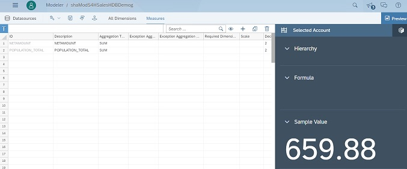

As mentioned above, this workshop will not spend much time on modeling and building analytics. There is a lot of info on those topics [here.](https://www.sapanalytics.cloud/guided_playlists/data-models/) When you are using a live connection to your HANA system it is recommended that you do as much of the modeling as you can in your Calculation Views. This of course is for best performance and also for the number of options and features in the HANA modeler. The one thing that we will do to add to this model in SAC is to add a Location Dimension that will be used in a map.

* Click on the "Create a Location Dimension" button.

&nbsp;&nbsp;&nbsp;&nbsp;&nbsp;&nbsp;&nbsp;&nbsp;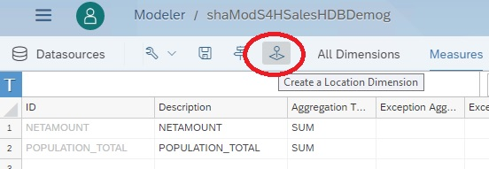

* Fill in this dialogue with info similar to below. 

&nbsp;&nbsp;&nbsp;&nbsp;&nbsp;&nbsp;&nbsp;&nbsp;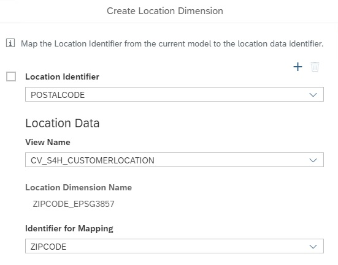

Note that the CV_S4H_CustomerLocation view is the simple geo-coding Calc View that you would have saved to the SAP_BOC_Spatial package in your HANA system. It is also important to note that the Location Dimension, ZIPCODE_EPSG3857, is the column in your GeoCode table that is a HANA Spatial Type (ST_Point to be exact) utilizing a Spatial Reference System of 3857. 

In order to have a successful Location Dimension in SAC you need to have a Calculation View in the SAP_BOC_Spatial package and that view must have at least one Spatial Type column. Of course the appropriate rights have to be assigned to your technical user (HACKT28) to the package and the underlying data. You have already done these steps. For more detailed information please see this part of the SAC online help: [Creating Geo model from Live HANA Calculation View.]( https://www.sapanalytics.cloud/guided_playlists/creating-geo-model-from-live-hana-calculation-view/)

* After you have filled in the dialogue press the OK button and then the "Save Model" button. There is no further work that you need to do in this model.

### <a name="sacmap"></a> Creating a SAC Story with a Map

The final step in this task, and the workshop, is to create a Story in the SAP Analytics Cloud. The Story will just have one analytic which will be a map. The map will show our sales data and customer locations (from the S/4HANA system) as well as the population totals from our census database in HANA. The geo-coding of the S/4HANA customers was done via a simple lookup in HANA and that matches a postal code to a centroid point which is a HANA Spatial Type column.

* After saving the model click on the Main Menu button and choose Create and then Story.

&nbsp;&nbsp;&nbsp;&nbsp;&nbsp;&nbsp;&nbsp;&nbsp;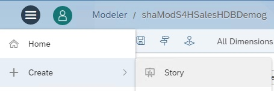

* Choose the "Add a Canvas Page" option which will give you a simple starting point. 

&nbsp;&nbsp;&nbsp;&nbsp;&nbsp;&nbsp;&nbsp;&nbsp;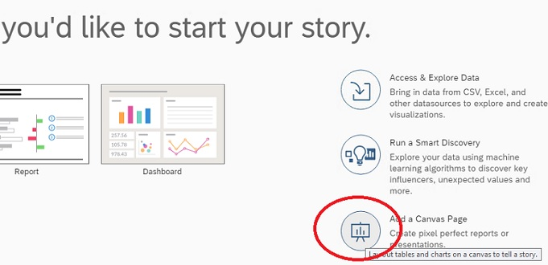

* Click on the Data button so that we can add our data source to this canvas and story.

&nbsp;&nbsp;&nbsp;&nbsp;&nbsp;&nbsp;&nbsp;&nbsp;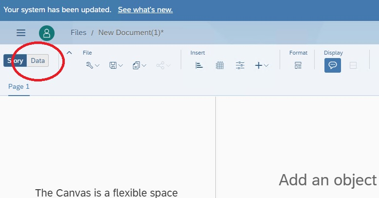

* Choose "Data acquired from an exsting model".

&nbsp;&nbsp;&nbsp;&nbsp;&nbsp;&nbsp;&nbsp;&nbsp;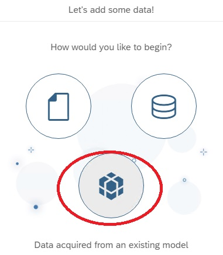

* Search for and select the model you created and then press OK.

&nbsp;&nbsp;&nbsp;&nbsp;&nbsp;&nbsp;&nbsp;&nbsp;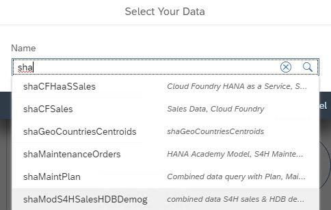

* Press the Story button to go back to your canvas.

&nbsp;&nbsp;&nbsp;&nbsp;&nbsp;&nbsp;&nbsp;&nbsp;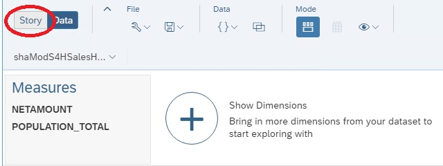

* Click on the Geo Map option.

&nbsp;&nbsp;&nbsp;&nbsp;&nbsp;&nbsp;&nbsp;&nbsp;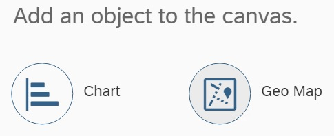

* In the Designer > Builder for the new map, click on "+ Add Layer".

&nbsp;&nbsp;&nbsp;&nbsp;&nbsp;&nbsp;&nbsp;&nbsp;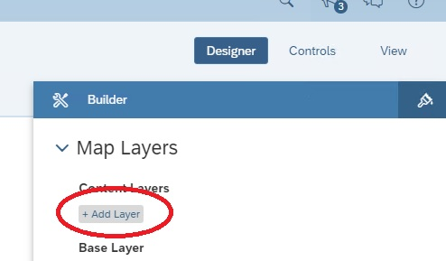

* Click on "Select model".

&nbsp;&nbsp;&nbsp;&nbsp;&nbsp;&nbsp;&nbsp;&nbsp;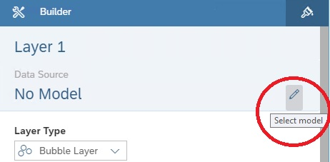

* You will see a select list of the models that have been added to the story as well as any other available models. Select your model and press OK.

&nbsp;&nbsp;&nbsp;&nbsp;&nbsp;&nbsp;&nbsp;&nbsp;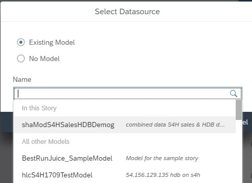

* FIll out the Designer > Builder dialogue with the following information.

```
Location Dimension:   ZipCode_EPSG3857

Bubble Color: Measures > Net Amount  (you can change the Palette to go from Red to Green if you wish)

Bubble Size: Measures > Population_Total (you can adjust the Size down to about 30% if you wish)

```

&nbsp;&nbsp;&nbsp;&nbsp;&nbsp;&nbsp;&nbsp;&nbsp;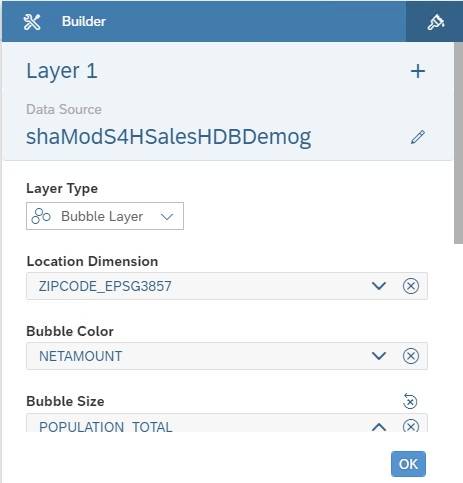

* Press the OK button and you should see a map similar to below. You might wish to Save your Story as well.

&nbsp;&nbsp;&nbsp;&nbsp;&nbsp;&nbsp;&nbsp;&nbsp;

You have now completed the step "Creating a SAC Story with a Map" and are done with the whole task of "Creation of Direct Connection to HANA and Analytics in SAP Analytics Cloud". 

You have also completed the entire exercise...congratulations and thanks for following along!

[Go Back to the Main Page](../demoHowTo.md)

[Go Back Up to the List of Steps](#steps)
