<table width=100% border=>
<tr><td colspan=2><h1>How to Extend S/4HANA with HANA Spatial and SAC</h1></td></tr>
<tr><td><h3>Setup of Remote Connection and Virtual Tables for S/4HANA</h3></td><td width=60%></br>&nbsp;Task #3, Using Data Provisioning &  Eclipse HANA Development</p></td></tr>
</table>

## Description

A connection needs to be made between the HANA database and the S/4HANA system. Afterwards, data from the ABAP CDS views will be virtualized in the target HANA database.


## Prerequisites

You should have completed all of the exercise [Prerequisites](../exercises/preReqs.md). You should have also completed [Task 2: Creation of Development User for the SAP HANA System](../exercises/hdbUser.md) using the Eclipse IDE.

## Steps

First you will need to install and configure the Data Provisioning Agent on the trial appliance's Windows client and then work in the Eclipse HANA Development Perspective to activate and configure the Smart Data Access components.

1. [Installing the Data Provisioning Agent](#sdidpa)

1. [Configuring the Data Provisioning Agent](#sdihdps)

1. [Creating a Remote Source and Virtual Tables](#sdarsvt)


### <a name="sdidpa"></a> Installing the Data Provisioning Agent

In order to connect your SAP HANA system to your S/4HANA system you need to first set up the Data Provisioning Agent. The Data Provisioning Agent provides secure connectivity between the SAP HANA database and your on-premise, adapter-based sources.

* Go to [tools.hana.ondemand](https://tools.hana.ondemand.com) where you can find a lot of the tools you'll need for SAP development > then click on the "Cloud Integration" tab > and scroll down to the "Data Integration Downloads" section.

* If you are using the S/4HANA trial then you will want to download the SDI Data Provisioning Agent for Windows. The download will take several minutes to complete.

* Note that this download is only for dev/testing purposes. Please contact your SAP representative should you need to license this product on a production system.

* The Data Provisioning Agent is a .SAR archive file so you will need to download sapcar.exe to extract it. Go to [help.sap.com](http://help.sap.com) and search on "sapcar" and you should see a link to "Installing the SAPCAR Utility".

* For an easy way to use sapcar follow the steps below from the blog post [here](https://blogs.sap.com/2012/04/12/easier-way-to-extract-sar-and-car-files-with-sapcar-under-windows/):

&nbsp;&nbsp;&nbsp;&nbsp;&nbsp;&nbsp;&nbsp;&nbsp;i)	Save sapcar.exe to your Downloads directory.\
&nbsp;&nbsp;&nbsp;&nbsp;&nbsp;&nbsp;&nbsp;&nbsp;ii)	In Notepad create a file named SAPCAR_e.BAT in the Downloads directory with the following contents.

```
SAPCAR.EXE -xvf %1, -R ".\sapcar_out"
Pause
```

&nbsp;&nbsp;&nbsp;&nbsp;&nbsp;&nbsp;&nbsp;&nbsp;iii)	Right click on the sar file and change the Open With dialogue so that all "sar" files point to the .bat file.

&nbsp;&nbsp;&nbsp;&nbsp;&nbsp;&nbsp;&nbsp;&nbsp;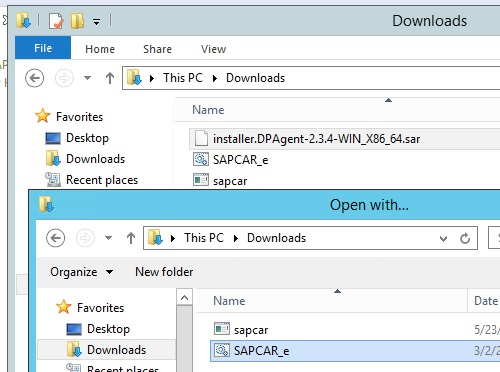

* Now double-click on your sapcar.sar file. You should see a new sapcar_out folder and the extracted contents inside. You may have to double-click on the file once more for this to happen.

* In the "HANA_DP_AGENT" folder the .exe that you need to run is the hdbsetup file.

&nbsp;&nbsp;&nbsp;&nbsp;&nbsp;&nbsp;&nbsp;&nbsp;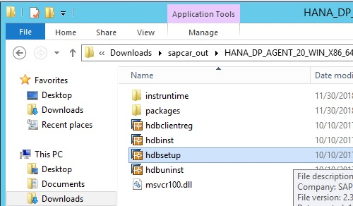

* Click Next to accept the first dialogue options / Define Dataprovagent Properties and in the second dialogue use the following information.

```
Agent Unique Name:  DPAgent

Domain\Username:  <your host name>\administrator  
  - where your host name is found via the Windows Command Prompt > hostname
  
Password:  <your Windows administrator password>
  - the password you used when you created the S/4HANA trial)
```

&nbsp;&nbsp;&nbsp;&nbsp;&nbsp;&nbsp;&nbsp;&nbsp;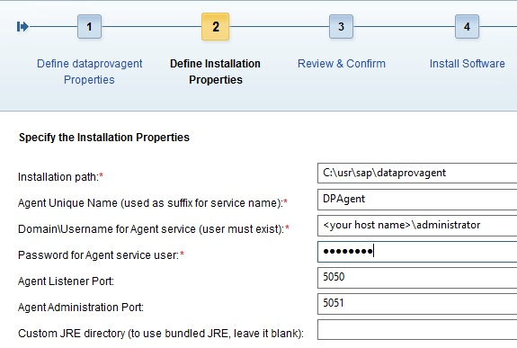

* After filling in the above info, click Next > and then Install > and then Finish when you get a success message.

You have now completed the step "Installing the Data Provisioning Agent". The next step is to configure the DPA connection to your HANA system.

[Go Back Up to the List of Steps](#steps)

### <a name="sdihdps"></a> Configuring the Data Provisioning Agent

The Data Provisioning Agent must now be connected to and then registered with your HANA system. Data adapters must also be registered with the HANA system and in this case it will be the ABAP Adapter.

* Click on the Windows icon in the lower left of your desktop client and then type "dpa" and then open the "SAP HANA Data Provisioning Agent...".

* The DPA Configuration dialogue should now be open. Click the "Connect to HANA" button. 

&nbsp;&nbsp;&nbsp;&nbsp;&nbsp;&nbsp;&nbsp;&nbsp;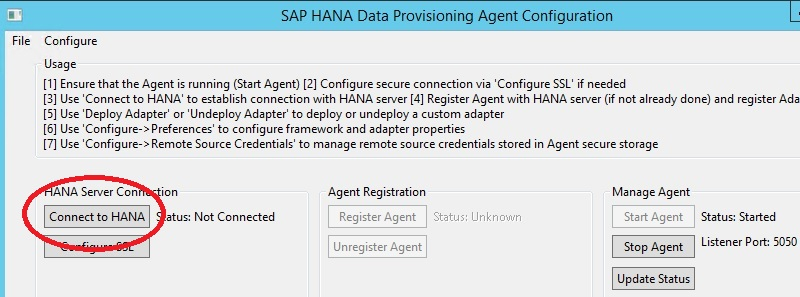

* Use the following information to fill out the connection dialogue:

```
HANA Hostname:  vhcalhdbdb 
  - remember that this name is in the Windows hosts file that we looked at in an earlier task
  
HANA Port:  30215  
 
HANA Agent Admin User:  hackt28 
  - this is the HANA development user we created earlier
 
HANA Agent Admin Password:  <your hackt28 user password>
  - the password you used in the script when you created the hackt28 user)
```
 
&nbsp;&nbsp;&nbsp;&nbsp;&nbsp;&nbsp;&nbsp;&nbsp;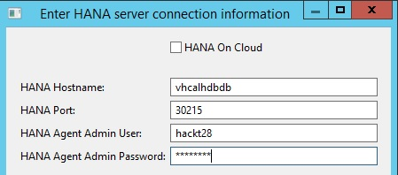

* After you've entered the above info press the Connect button.

* You should now see the connection info for your HANA system. Now click on the Register Agent button.

&nbsp;&nbsp;&nbsp;&nbsp;&nbsp;&nbsp;&nbsp;&nbsp;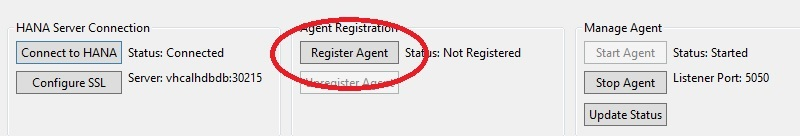

* In the Register Agent dialogue fill in the Agent Name and leave the default entry for the Agent Hostname.

```
Agent Name: DPAgent
```

&nbsp;&nbsp;&nbsp;&nbsp;&nbsp;&nbsp;&nbsp;&nbsp;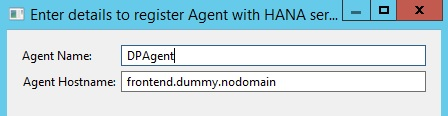

* Press the Register button.

* Now that the Agent is regsitered with your HANA system you need to register the Adapter that will later be used to connect to your S/4HANA system's ABAP data dictionary objects. Select the ABAP Adapter and then click on the Register Adapter button. 

&nbsp;&nbsp;&nbsp;&nbsp;&nbsp;&nbsp;&nbsp;&nbsp;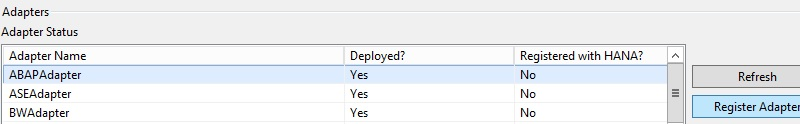

You have now completed the step "Configuring the Data Provisioning Agent".

For more info on installing and configuring the Data Provisioning Agent, go to [help.sap.com Smart Data Integration]( https://help.sap.com/viewer/p/HANA_SMART_DATA_INTEGRATION) > in the Intallation and Upgrade section > click on the Installation and Configuration Guide

[Go Back Up to the List of Steps](#steps)

### <a name="sdarsvt"></a> Creating a Remote Source and Virtual Tables

&nbsp;&nbsp;&nbsp;&nbsp;&nbsp;&nbsp;&nbsp;&nbsp;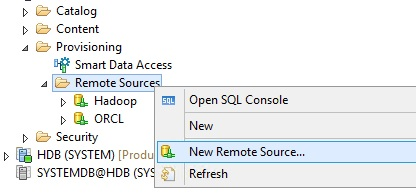

&nbsp;&nbsp;&nbsp;&nbsp;&nbsp;&nbsp;&nbsp;&nbsp;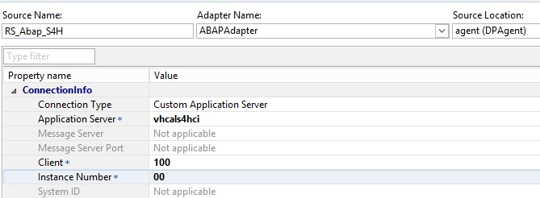

&nbsp;&nbsp;&nbsp;&nbsp;&nbsp;&nbsp;&nbsp;&nbsp;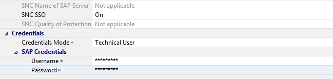

&nbsp;&nbsp;&nbsp;&nbsp;&nbsp;&nbsp;&nbsp;&nbsp;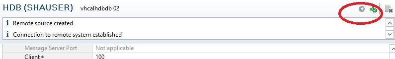

&nbsp;&nbsp;&nbsp;&nbsp;&nbsp;&nbsp;&nbsp;&nbsp;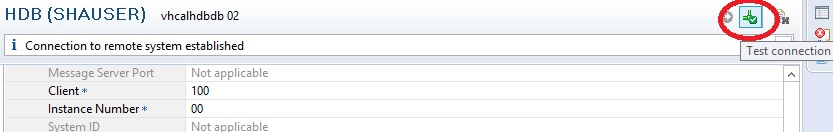


SDI ABAP Adapter https://www.youtube.com/watch?v=ZNr7xc3FHm0&list=PLkzo92owKnVwQ_preA3cxlQjn_v3W0Eh5&index=52&t=0s

You have now completed "Creating a Remote Source and Virtual Tables"  and are done with the whole task of "Setup of Remote Connection and Virtual Tables for S/4HANA".

Your next task is to set up a sample database in your HANA system.  The database consists of US Census data as well as a table used to approximate the Longitude and Latitude of customer addresses in the S/4HANA sales data.

[Go to Task 4: Setup of Sample Database for the SAP HANA System](hdbData.md)

[Go Back to the Main Page](../demoHowTo.md)

[Go Back Up to the List of Steps](#steps)
